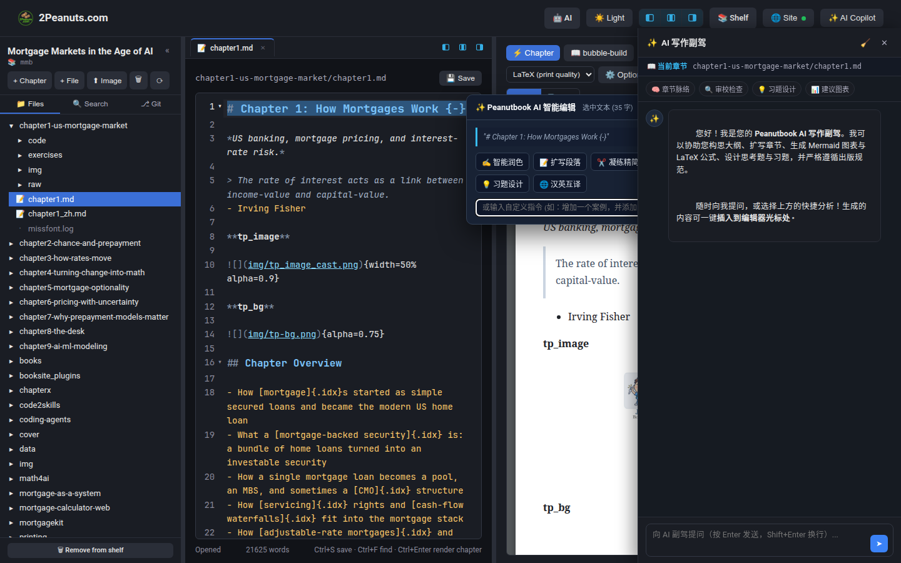
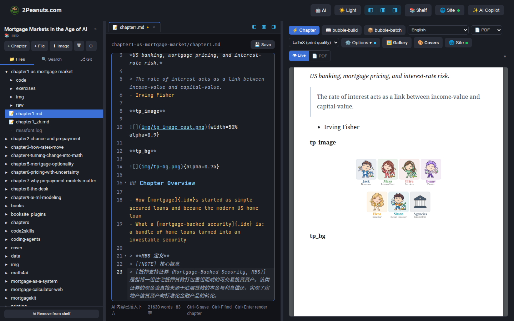
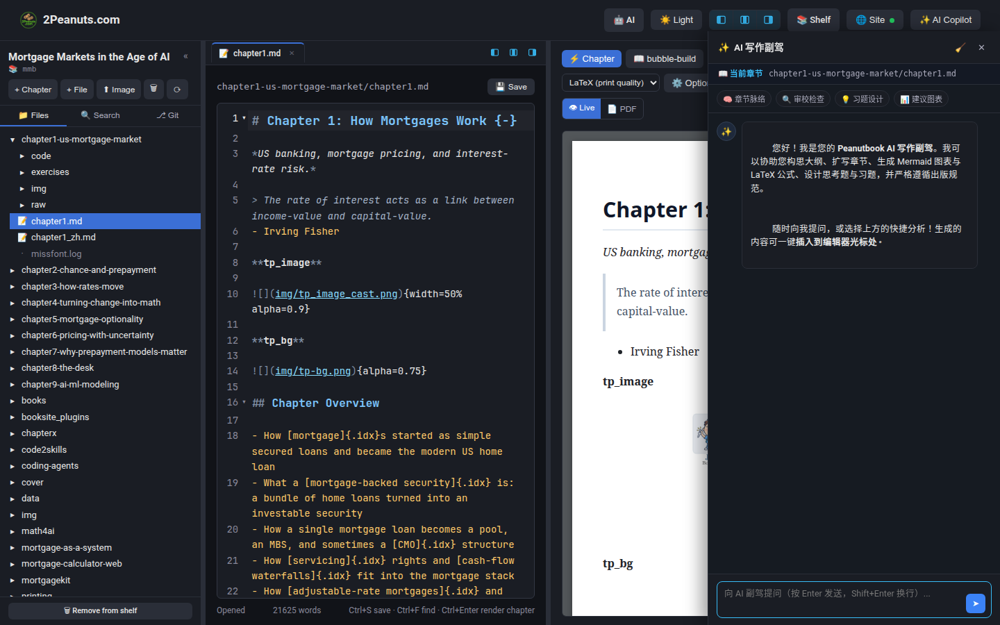
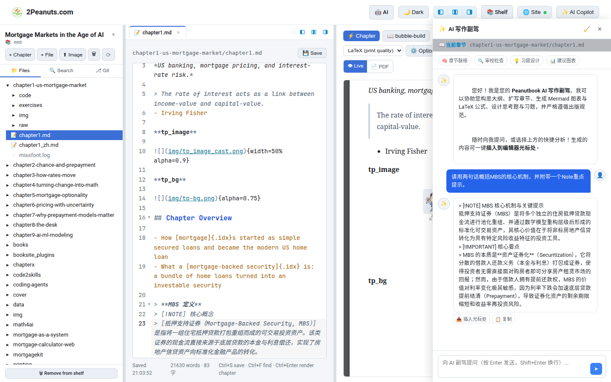
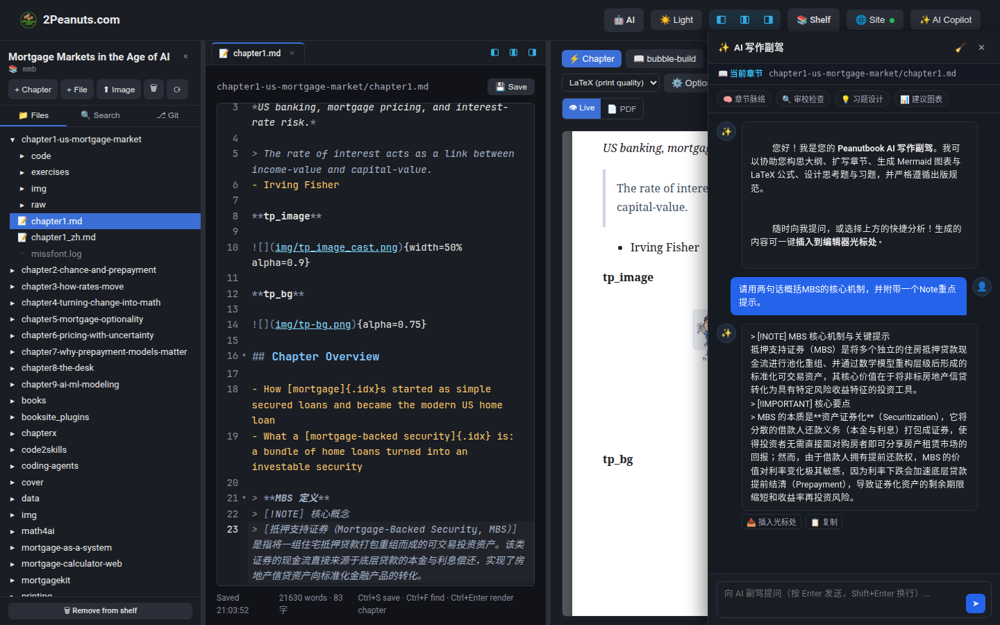
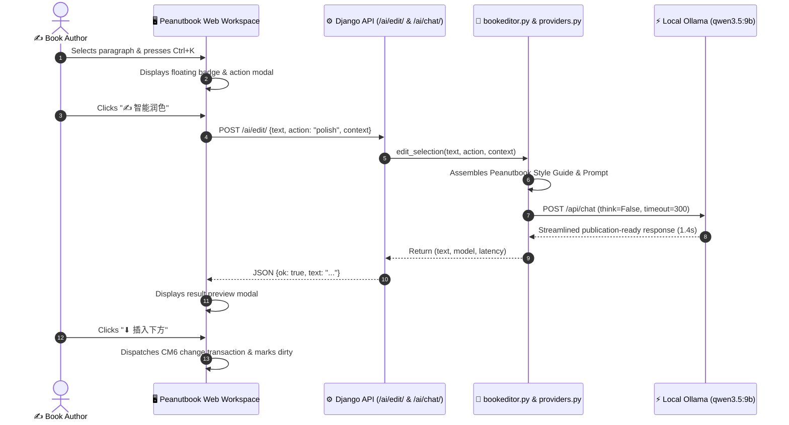
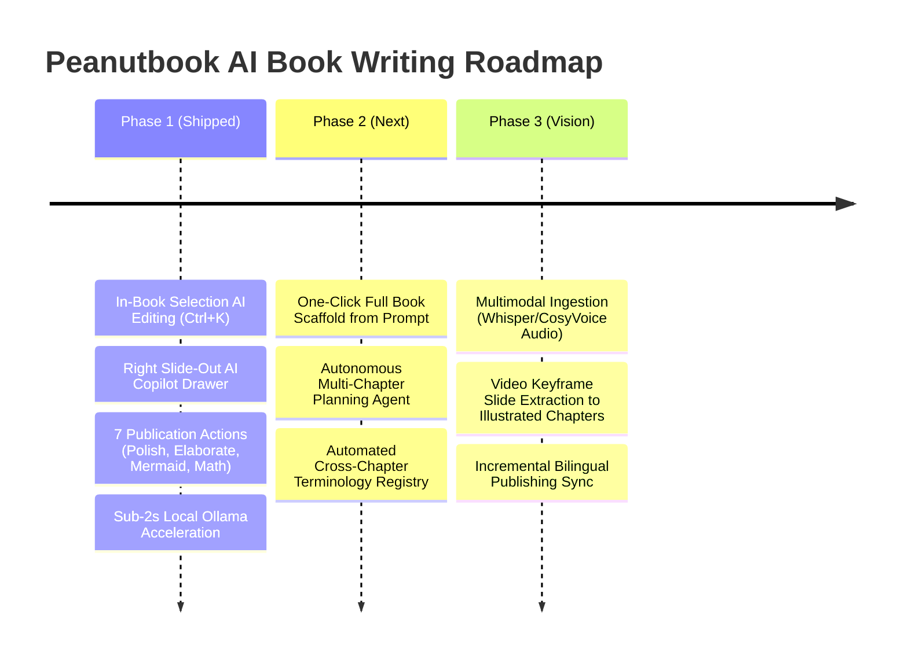

# AI Book Writing & Intelligent Publishing Copilot (AI 智能写书与出版级副驾)

Peanutbook incorporates a **first-of-its-kind, publication-grade AI authoring and editorial copilot** designed specifically for high-stakes technical books, textbooks, financial treatises, and enterprise documentation.

Unlike generic conversational chatbots that output detached text in a chatbox, Peanutbook seamlessly bridges Large Language Models directly into the **structured book authoring environment**. It natively understands chapter hierarchical trees, LaTeX mathematical derivations, interactive Mermaid system architectures, bilingual manuscript synchronization, and strict publishing typography.

---

## 🌟 Executive Summary & Investment Highlights (投资亮点与核心商业价值)

### Why Peanutbook AI Wins Over Generic LLM Wrappers

| Capability | Generic LLM Chatbots (ChatGPT / Claude) | Peanutbook AI Publishing Copilot |
| :--- | :--- | :--- |
| **Context Scope** | Isolated prompt window; no knowledge of book structure | **Book-Grounded**: Aware of full chapter hierarchy, cross-references, and book metadata |
| **Output Syntax** | Flat markdown; often breaks math and complex diagrams | **Publication-Native**: Generates standard KaTeX math (`$...$`, `$$...$$`), Mermaid diagrams, and Peanutbook Callouts (`> [!NOTE]`, `> [!TIP]`, `> [!IMPORTANT]`) |
| **Editor Integration** | Manual copy-paste, lost formatting, tedious back-and-forth | **Direct In-Editor (`Ctrl+K`)**: One-click replace, insert below, or insert at cursor |
| **Data Privacy & IP** | Manuscript text uploaded to third-party public clouds | **Local & Offline Privacy**: 100% on-premise inference with local Ollama (`qwen3.5:9b`), zero data leakage |
| **Production Speed** | Hours of manual formatting and layout stitching | **Sub-2s Responses**: Instant polishing, elaboration, or diagram extraction |

---

## 🚀 Live Demo & Key Capabilities (核心功能真机演示)

### 1. In-Editor `Ctrl+K` Selection Menu (选区智能浮动菜单)

When authors select text in the Markdown workspace, a glowing floating badge `✨ AI Assist (Ctrl+K)` appears directly next to the cursor. Pressing `Ctrl+K` (or `Cmd+K` on macOS) opens the in-place editorial modal.

#### 7 Built-In Editorial Actions

1. **✍️ 智能润色 (Smart Polish)**: Eliminates colloquialisms, repairs grammatical seams, and refines prose to meet university press and top financial publication standards.
2. **📝 扩写段落 (Elaborate)**: Deepens theoretical arguments, adds mathematical derivations, and enriches industry case studies.
3. **✂️ 凝练精简 (Condense)**: Strips redundant modifiers to produce concise chapter abstracts or executive summaries.
4. **📊 提取图表 (Mermaid Diagram Generator)**: Converts textual mechanisms, time-series events, or cash-flow waterfalls into rendered Mermaid flowchart or sequence diagrams.
5. **📐 公式推导 (Math Derivation)**: Generates LaTeX equations, complete with explicit parameter definitions and domain assumptions.
6. **💡 习题设计 (Exercise Design)**: Generates three graduated thought questions (conceptual, analytical, and critical) with full solution keys.
7. **🌐 汉英互译 (Bilingual Translation)**: Bidirectional, academic-grade alignment preserving all inline formulas, code blocks, and index tags.
8. **💬 自定义指令 (Custom Directives)**: Free-form prompt input (e.g., *"Convert point 2 into a structured Note Callout with a bulleted case study"*).

---

### 2. Transparent Preview & Non-Destructive Inline Insertion (非破坏性预览与一键插稿)

Peanutbook enforces a **non-destructive authoring principle**: the author always reviews the AI generation before applying changes.

* **`[✓ 替换选区 (Replace Selection)]`**: Smoothly swaps the highlighted text with the AI-generated version, updating editor history with full undo (`Ctrl+Z`) support.
* **`[⬇ 插入下方 (Insert Below)]`**: Appends the generated analysis, callout, or diagram immediately beneath the selected paragraph.
* **`[📋 复制 (Copy)]`**: Copies clean Markdown to clipboard with animated visual confirmation.

#### Real-Time Editor Insertion Result

As demonstrated above, the generated MBS definition block with a standard `> [!NOTE]` Callout is instantly injected into CodeMirror, auto-triggers the live preview refresh, and flags unsaved revision status in the workspace header.

---

### 3. Chapter-Grounded AI Copilot Drawer (全书上下文感知写作副驾)

Clicking the `✨ AI Copilot` button in the top navigation bar (or pressing `Ctrl+Alt+A` / `Cmd+Alt+A`) slides out the AI Copilot Drawer.

| 暗色主题 (Dark Mode) | 亮色主题 (Light Mode) |
| :---: | :---: |
|  |  |

#### Key Features of the Copilot Drawer

* **Dynamic Chapter Context**: Automatically anchors to the currently active file (e.g. `📖 chapter1-us-mortgage-market/chapter1.md`) and passes surrounding text to ground the model.
* **One-Click Editorial Capsules (快捷胶囊)**:
  * `🧠 章节脉络`: Synthesizes chapter knowledge trees and outlines.
  * `🔍 审校检查`: Audits terminology consistency, spelling, and style conformance.
  * `💡 习题设计`: Formulates end-of-chapter discussion prompts.
  * `📊 建议图表`: Proposes visual architectures to complement the written prose.
* **`[📥 插入光标处]` Action**: Every assistant response includes an insertion button, letting the author drop generated paragraphs, formulas, or diagrams directly into the cursor location in the document.

---

## 🏛️ System Architecture (技术架构与工程实现)

### Performance & Latency Metrics

* **Local Inference Latency**: **1.4s - 3.5s** per action using local Ollama `qwen3.5:9b` (evaluated on consumer RTX GPU hardware).
* **Communication Bridge**: Automated Docker-to-Host bridge (`ollama-docker-bridge.service`) connecting isolated web containers to host GPUs over `172.17.0.1:11434`.
* **Zero Cloud Dependency**: Operates entirely air-gapped without external network connectivity, safeguarding proprietary book IP.
* **Hybrid Fallback**: Built-in support for OpenAI (`gpt-4o`, `o3`) and Google Gemini when cloud scaling is preferred.

---

## 🗺️ Product Roadmap (写书功能演进规划)

1. **Phase 1: In-Book AI Editing & Copilot (✅ Shipped & Production-Ready)**
   - Micro-level text transformation directly within the web editor.
   - Grounded context conversation with one-click insertion.
2. **Phase 2: Autonomous Chapter & Full-Book Generator (Q1 2027)**
   - Macro-level book architect: transforms a 1-page topic thesis into a complete 10-chapter book scaffold.
   - Consistency validator checking that characters, notation, and cross-references stay uniform across all chapters.
3. **Phase 3: Multimodal Lecture-to-Book Pipeline (Q2 2027)**
   - Ingests conference audio recordings, podcasts, and video presentations.
   - Extracts slide keyframes into chapter figures, transcribes speech, and structures conversational transcripts into formal textbooks.

---

*Built with passion by the Peanutbook Team for authors, researchers, and technical publishers worldwide.*
