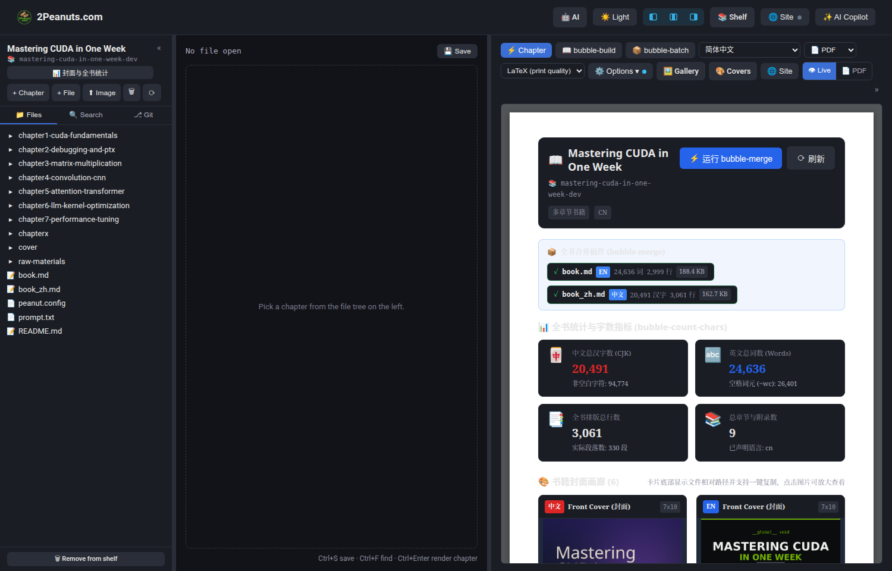
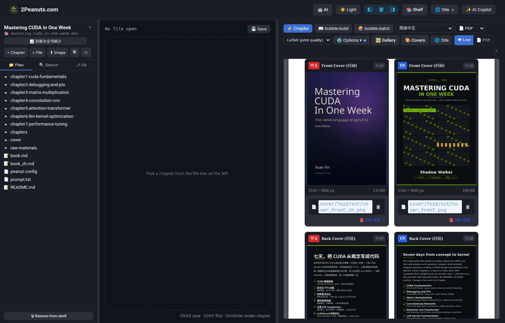
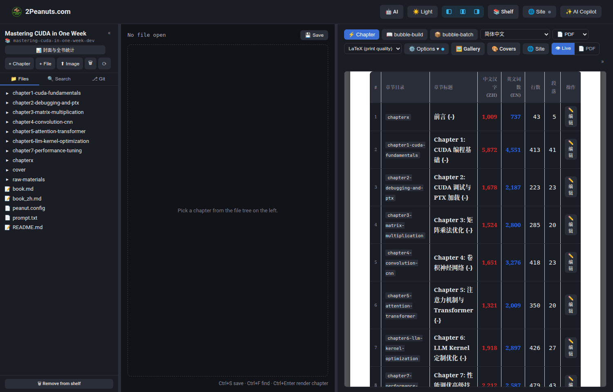
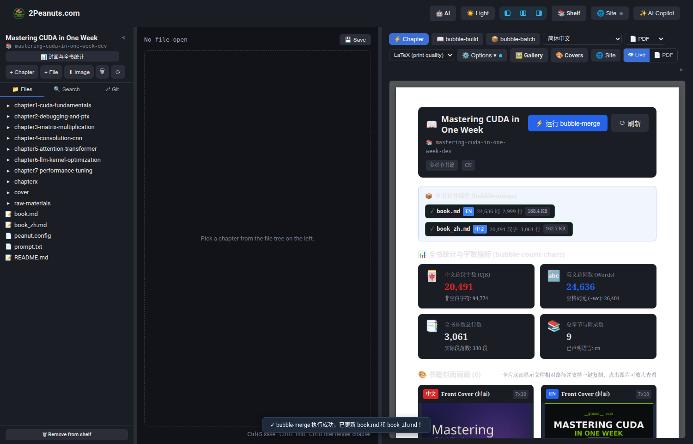

# Book Overview & Editorial Dashboard

Peanutbook provides a dedicated **Book Overview & Editorial Dashboard** directly within the book workspace (`http://localhost:1979/books/<book>/`). 

When opening a book workspace or clicking **📊 封面与全书统计 (Overview)** in the sidebar, the workspace's Live preview panel transitions into a rich editorial command center integrating pre-rendered **Book Covers Gallery**, real-time manuscript metrics from **`bubble-count-chars`**, and one-click whole-book regeneration via **`bubble-merge`**.



---

## 1. Key Features

### 🎨 Book Covers Gallery with Relative File Paths
The gallery automatically discovers all pre-rendered front covers, back covers, and full-wrap paperback/hardcover designs across all configured languages and trim sizes (e.g. `7x10`, `6x9`).



Every cover card features:
- **Language Badge & Type Tag**: Clearly identifies edition language (`ZH`, `EN`, `TC`, etc.) and panel type (e.g. *Front Cover*, *Back Cover*, *Full Wrap Cover*).
- **Aspect-Ratio Preview**: High-fidelity image thumbnail with hover zoom. Clicking opens a fullscreen lightbox modal.
- **Dimensions & File Size**: Instant display of pixel resolution (e.g. `2100 × 3000 px`) and file size on disk (e.g. `1.0 MB`).
- **File Relative Path at Card Footer**: Every cover card prominently displays its relative path from the book root (e.g. `cover/7x10/out/cover_front_zh.png`) along with a one-click clipboard copy button (`📋`) and direct links to print-ready PDFs (`📕 PDF 预览 ↗`).

```
+-------------------------------------------------------------+
| [ZH]  Front Cover (封面)                              7x10  |
|                                                             |
|                   [ Cover Image Preview ]                   |
|                                                             |
| 2100 x 3000 px                                       1.0 MB |
|-------------------------------------------------------------|
| 📄 cover/7x10/out/cover_front_zh.png                   [📋] |
|                                             📕 PDF 预览 ↗   |
+-------------------------------------------------------------+
```

---

## 2. Interactive Cover Lightbox

Clicking any cover thumbnail in the gallery opens a focused, distraction-free lightbox overlay to inspect high-resolution typography, cover artwork, barcode placement, and spine alignment:


Pressing `Esc` or clicking outside the modal closes the lightbox view.

---

## 3. Real-Time Manuscript Metrics (`bubble-count-chars`)

The dashboard incorporates the core analysis engine from `bubble-count-chars`, presenting essential metrics across languages:

- 🀄 **Chinese CJK Ideographs (汉字)**: Exact count of Chinese characters (`\u4e00-\u9fff`) alongside non-whitespace characters.
- 🔤 **English Word Count**: Letter-token words (matching hyphenated and apostrophe contractions) alongside whitespace fields (`wc -w`).
- 📑 **Typesetting Lines & Paragraphs**: Clean prose line count and paragraph stanzas excluding markup comments, image placeholders, and subtitles.
- 📚 **Total Chapters**: Total number of chapters, prefaces, and appendices.

---

## 4. Per-Chapter Breakdown Table

Below the summary KPI cards, an itemized chapter table breaks down volume metrics chapter by chapter:



| # | Chapter Directory | Chapter Title | Chinese (ZH) | English (EN) | Lines | Paragraphs | Action |
|---|---|---|---|---|---|---|---|
| 1 | `chapterx` | 前言 {-} | 1,009 | 737 | 43 | 5 | ✏️ 编辑 |
| 2 | `chapter1-cuda-fundamentals` | Chapter 1: CUDA 编程基础 {-} | 5,872 | 4,551 | 413 | 41 | ✏️ 编辑 |
| 3 | `chapter2-debugging-and-ptx` | Chapter 2: CUDA 调试与 PTX 加载 {-} | 1,678 | 2,187 | 223 | 23 | ✏️ 编辑 |
| ... | ... | ... | ... | ... | ... | ... | ✏️ 编辑 |

Clicking the **✏️ 编辑 (Edit)** button directly navigates to and opens the selected chapter markdown file in the CodeMirror editor pane.

---

## 5. Whole-Book Merge Integration (`bubble-merge`)

Clicking the **⚡ 运行 bubble-merge** button at the top of the dashboard triggers the backend `merge_books` pipeline:



1. Gathers all chapter markdown files in book sequence.
2. Concatenates them into root monolithic manuscript artifacts:
   - `book.md` (English edition)
   - `book_zh.md` (Simplified Chinese edition)
   - `book_<lang>.md` (Other localized editions)
3. Refreshes word and character metrics instantly, showing a confirmation toast notification upon completion.

---

## 6. Accessing the Dashboard

You can return to the Book Overview Dashboard at any time:
- By navigating to `http://localhost:1979/books/<book>/` without a file parameter.
- By clicking the **📊 封面与全书统计 (Overview)** button in the left file tree sidebar.
- By clicking the book name or folder path at the top of the primary sidebar.
