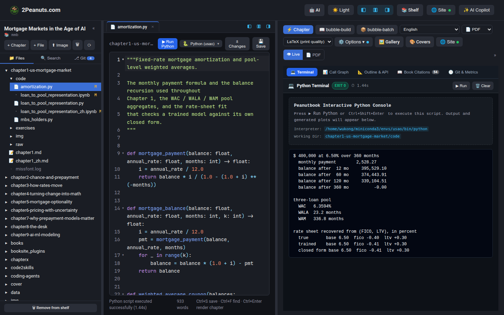
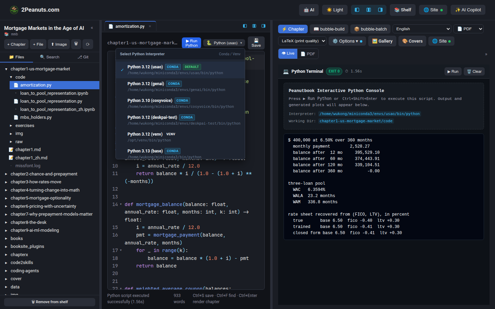
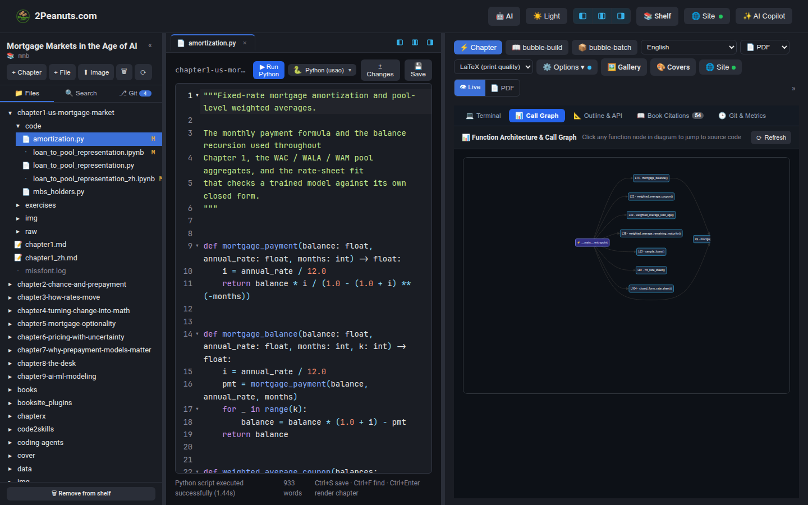
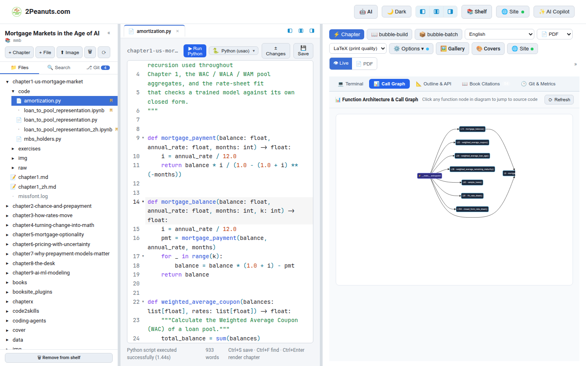
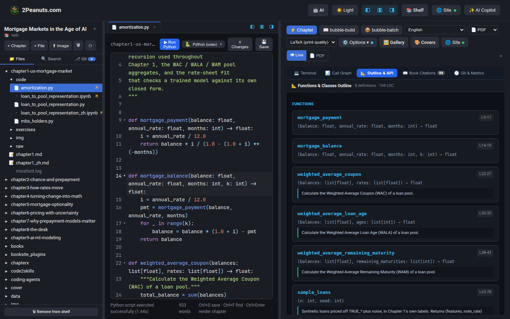
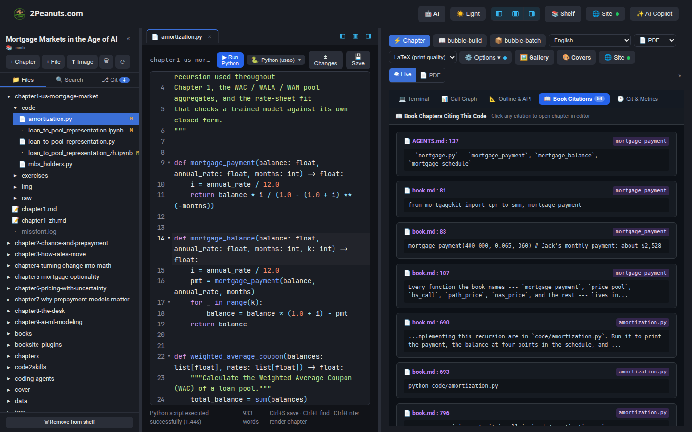
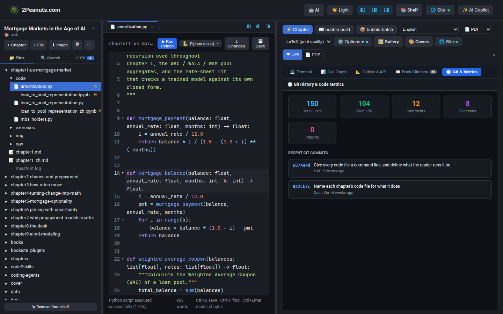

# Interactive Python Runner & Code Insights Hub (代码教学与工程洞察中心)

Peanutbook includes a **built-in interactive Python execution engine and pedagogical Code Insights Hub** specifically tailored for technical books, quantitative finance treatises, and engineering documentation.

When authoring or reading technical literature containing executable code (such as mortgage pricing models, machine learning algorithms, or data pipelines), authors and readers no longer need to switch between an IDE, a terminal, and the book. Peanutbook transforms any `.py` script in the book project into an **interactive, pedagogical companion** that directly bridges executable algorithms with the book's manuscript text.

---

## 🌟 Overview & Key Pedagogical Capabilities

```mermaid
flowchart LR
    subgraph Input ["Source Python Script"]
        PY["🐍 .py Code File\n(e.g., amortization.py)"]
    end

    subgraph Engine ["Peanutbook AST & Runtime Analysis"]
        AST["🌳 AST Syntax Analyzer"]
        SCAN["🔍 Manuscript Citation Scanner"]
        RUN["⚡ Multi-Env Subprocess Runner"]
        GIT["🕒 Git History & LOC Metrics"]
    end

    subgraph Hub ["5-Tab Code Insights Hub"]
        T1["💻 1. Interactive Terminal"]
        T2["📊 2. Dynamic Call Graph"]
        T3["📐 3. Outline & API Signatures"]
        T4["📖 4. Book Citations & Cross-Refs"]
        T5["🕒 5. Git Log & Quality Metrics"]
    end

    Input --> Engine
    Engine --> Hub
```



### Why Technical Publishing Demands Integrated Code Insights

| Dimension | Traditional Book Writing (Word / Static Markdown) | Peanutbook Code Insights & Runner |
| :--- | :--- | :--- |
| **Code Executability** | Copy-pasted dead code; prone to silent bitrot | **Live in-browser execution** with 1-click run (`Ctrl+Shift+Enter`) and sub-second feedback |
| **Environment Control** | Ambiguous external setups and library mismatches | **Multi-interpreter selector**: auto-detects Conda envs (e.g. `usao`), system Python, or book-specific venvs |
| **Architectural Clarity** | Readers struggle to trace complex caller-callee trees | **Interactive Call Graph**: visualizes `__main__` entrypoints and inter-function calls via Mermaid |
| **Text-Code Alignment** | Authors forget which chapters reference which functions | **Bidirectional Citation Tracker**: automatically finds all chapters referencing the script or functions |
| **Pedagogical Navigation** | Endless scrolling through hundreds of lines of code | **One-click jump**: clicking any graph node, API card, or citation jumps directly to the source code line |

---

## 🚀 The 5-Tab Code Insights Hub

When any Python script (`.py`) is opened in the Peanutbook Workspace, the right preview pane automatically switches from standard PDF/Live view to the **Code Insights Hub**.

---

### 1. 💻 Interactive Terminal (`Terminal`)

The interactive terminal provides zero-friction execution directly against the configured Python environment on the host or development container.



#### Highlights:
* **One-Click Execution**: Click `▶ Run Python` in the top action bar or press `Ctrl+Shift+Enter`.
* **Execution Status & Telemetry**: Displays exit code badges (`Exit 0` in emerald, nonzero in crimson) and elapsed execution time in milliseconds.
* **Interpreter Dropdown**: Seamlessly switch between Conda environments (such as `usao`), the project virtual environment, or system Python.
* **Matplotlib Figure Detection**: Scripts that output or save `.png`/`.jpg` figures have their visuals automatically captured and embedded beneath the console logs.



---

### 2. 📊 Dynamic Call Graph (`Call Graph`)

The Call Graph tab employs Python's standard `ast` (Abstract Syntax Tree) module to statically extract the structure of the script: entrypoint blocks (`if __name__ == '__main__':`), function definitions, and caller-callee relationships.

| Dark Theme Call Graph | Light Theme Call Graph |
| :---: | :---: |
|  |  |

#### Highlights:
* **Mermaid Vector Flowchart**: Automatically compiled and rendered as crisp, vector graphics with publication-grade node palettes.
* **Interactive Code Jumping**: Every function node in the SVG diagram is interactive. Clicking on a node (such as `mortgage_balance`) instantly focuses CodeMirror and navigates the cursor to the exact line of the function definition.
* **Theme-Aware Styling**: Perfectly harmonized with both Dark and Light themes.

---

### 3. 📐 Outline & API Signatures (`Outline & API`)

The Outline tab serves as an interactive table of contents for classes and functions within the script.



#### Highlights:
* **Type Annotations & Arguments**: Extracts complete parameter signatures including type hints (e.g. `(balances: list[float], rates: list[float]) -> float`).
* **Docstring Rendering**: Parses and structures function docstrings into readable pedagogical descriptions.
* **Line Number Badges**: Displays start-to-end line pills (e.g. `L22-27`). Clicking any card or badge jumps the editor directly to that block.

---

### 4. 📖 Book Citations & Manuscript Cross-Referencing (`Book Citations`)

Technical books often reference scripts and functions across multiple chapters. The Book Citations tab performs an indexed full-text scan of all Markdown chapters in the book repository to pinpoint every occurrence.



#### Highlights:
* **Multi-Chapter Indexing**: Tracks mentions of the script filename (e.g. `amortization.py`) as well as individual function and class names.
* **Contextual Snippets**: Displays the exact line number in the target chapter and a contextual snippet of the surrounding paragraph or code block.
* **Click-to-Traverse**: Clicking any citation card immediately opens that chapter in the editor, providing a seamless bidirectional link between code and theory.

---

### 5. 🕒 Git History & Quality Metrics (`Git & Metrics`)

The Git & Metrics tab provides instant visibility into the script's software engineering health and revision history.



#### Highlights:
* **Metric Stat Cards**:
  * **Total Lines**: Overall length of the file.
  * **Code LOC**: Pure logic lines excluding blank lines and comments.
  * **Comments**: Documented line count.
  * **Functions**: Total number of top-level and helper functions.
  * **Imports**: Number of module dependencies imported.
* **Recent Git Commits**: Displays the recent commit log for the specific file, including commit hash, commit message, author name, and relative timestamp.

---

## ⌨️ Productivity Keyboard Shortcuts

| Shortcut | Context | Action |
| :--- | :--- | :--- |
| `Ctrl+Shift+Enter` (or `Cmd+Shift+Enter`) | Python file open | **Run script** immediately in the interactive terminal |
| `Ctrl+S` (or `Cmd+S`) | Workspace editor | Save file changes and refresh live diagnostics |
| `Ctrl+F` (or `Cmd+F`) | Workspace editor | Open in-editor search bar |
| `Click on Call Graph Node` | Call Graph tab | Navigate editor directly to function definition line |
| `Click on API Card Badge` | Outline tab | Navigate editor directly to function / class line |
| `Click on Citation Card` | Citations tab | Open the citing chapter file in the workspace |

---

## 🛠️ Backend API Endpoints

For developers and plugin integrators, Peanutbook exposes dedicated JSON endpoints for Python analysis and execution:

### 1. Execute Script
* **Endpoint**: `POST /books/<book>/python/run/`
* **Payload**: `{"path": "chapter1/code/amortization.py", "python": "usao"}`
* **Response**:
  ```json
  {
    "ok": true,
    "exit_code": 0,
    "stdout": "...",
    "stderr": "",
    "seconds": 1.44,
    "python": "/home/wukong/miniconda3/envs/usao/bin/python",
    "images": []
  }
  ```

### 2. Extract Insights & Call Graph
* **Endpoint**: `GET /books/<book>/python/insights/?path=chapter1/code/amortization.py`
* **Response**:
  ```json
  {
    "ok": true,
    "filename": "amortization.py",
    "metrics": {
      "total_lines": 150,
      "code_lines": 104,
      "comment_lines": 12,
      "functions_count": 8,
      "imports_count": 0
    },
    "functions": [...],
    "classes": [...],
    "mermaid_graph": "flowchart LR ...",
    "citations": [
      {
        "file": "book.md",
        "line": 690,
        "term": "amortization.py",
        "snippet": "...in code/amortization.py..."
      }
    ],
    "git_log": [...]
  }
  ```
