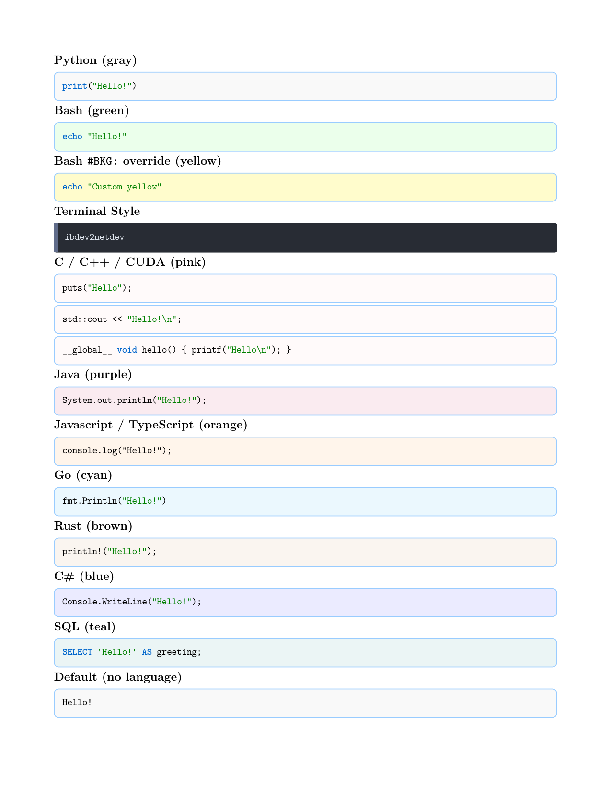

# Peanutbook syntax reference

This page documents **Peanutbook** — the Markdown-based book format. Standard CommonMark applies unless noted below. The build toolchain (`peanutbook`) applies these rules via Pandoc and Lua filters when you run `bubble-convert` or `bubble-build`.

See also [What is Peanutbook?](what-is-peanutbook.md) and [Chapter format](chapter-format.md).

## Syntax for NOTE Sections: NOTES-NOTEE format

Use blockquote syntax with `>NOTES:` and `>NOTEE` markers to create special note sections that will be rendered in a custom LaTeX environment.

**Format:**
```markdown
>NOTES: Your note content here. This can span multiple lines.

Additional paragraphs in the note section.

>NOTEE
```

**Example:**
```markdown
>NOTES: The general definition of an inner product requires it to satisfy certain axioms (positive definiteness, bilinearity, symmetry). The standard inner product in $\mathbb{R}^d$ is a specific example that satisfies these axioms.

>NOTEE
```

**Notes:**
- `>NOTES:` marks the start of a note section (note start)
- `>NOTEE` marks the end of a note section (note end) and there must be an empty line before it
- The markers will be removed from the output
- Content between markers will be wrapped in a `notesection` LaTeX environment

## Syntax for IMPORTANT Sections: IMPORS-IMPORE format

Use blockquote syntax with `>IMPORS:` and `>IMPORE` markers to create important sections that highlight key concepts, formulas, solution techniques, or cautions.

**Format:**
```markdown
>IMPORS: Your important content here. This can span multiple lines.

Additional paragraphs in the important section.

>IMPORE
```

**Example:**
```markdown
>IMPORS: The matrix inverse (defined above) serves as the analog of division in matrix algebra, allowing us to "undo" matrix multiplication and solve linear systems.

>IMPORE
```

**Notes:**
- `>IMPORS:` marks the start of an important section (important start)
- `>IMPORE` marks the end of an important section (important end) and there must be an empty line before it
- The markers will be removed from the output
- Content between markers will be wrapped in an `importantsection` LaTeX environment
- Important sections are rendered with a blue background and blue border to distinguish them from regular notes

## Syntax for WARNING Sections: WARNS-WARNE format

Use blockquote syntax with `>WARNS:` and `>WARNE` markers to create warning sections that highlight common mistakes or pitfalls.

**Format:**
```markdown
>WARNS: Your warning content here. This can span multiple lines.

Additional paragraphs in the warning section.

>WARNE
```

**Example:**
```markdown
>WARNS: In general, $AB \neq BA$ (matrix multiplication is non-commutative). This has important implications in machine learning: in **neural networks**, layer order matters ($W_2 W_1 \mathbf x \neq W_1 W_2 \mathbf x$); in **attention mechanisms**, $QK^\top$ has different dimensions than $K^\top Q$; in **optimization**, operation order affects gradient flow.

>WARNE
```

**Notes:**
- `>WARNS:` marks the start of a warning section (warning start)
- `>WARNE` marks the end of a warning section (warning end) and there must be an empty line before it
- The markers will be removed from the output
- Content between markers will be wrapped in a `warnsection` LaTeX environment
- Warning sections are rendered with an orange background and orange border to draw attention to common mistakes

## Syntax for page-centered blocks: CENTERS-CENTERE format

Use blockquote syntax with `>CENTERS:` and `>CENTERE` markers to center a block horizontally and vertically on the page (typical for **Dedication**, epigraph, or short front-matter text in `chapterx/preface.md`).

**Format:**
```markdown
>CENTERS:

__To my parents, Name One and Name Two.__

*- Author Name*

>CENTERE
```

**Example (dedication in preface):**
```markdown
\newpage

>CENTERS:

__To my parents, Chuntao He and Zongyuan Wu.__

*- Fuheng Wu*

>CENTERE

\newpage

# Preface
```

Optional `# Dedication` before `>CENTERS:` is allowed as an editor marker; it is **not** printed in PDF or EPUB (only the centered text appears).

**Offset options (PDF):** shift the centered block from the default vertical/horizontal center. Use either:

1. **On the start line** (after `CENTERS:`):

```markdown
>CENTERS: down=1.5cm right=0.5cm
```

2. **On their own lines** immediately after `>CENTERS:` (before the body content):

```markdown
>CENTERS:
down=1.5cm
left=0.3cm
```

| Option | Effect |
|--------|--------|
| `up=<length>` | Move block up (e.g. `up=2cm`, `up=12pt`) |
| `down=<length>` | Move block down |
| `left=<length>` | Move block left |
| `right=<length>` | Move block right |
| `voffset=<length>` | Signed vertical shift (`-2cm` = up, `2cm` = down) |
| `hoffset=<length>` | Signed horizontal shift (`-1cm` = left, `1cm` = right) |
| `width=<length>` | Inner text width (default `0.75\textwidth`) |

Lengths use standard LaTeX units (`cm`, `mm`, `pt`, `in`, etc.). Multiple options can appear on one line, space-separated.

**Example with photo and downward shift:**

```markdown
>CENTERS: down=1cm


__To my parents, Chuntao He and Zongyuan Wu.__

*- Fuheng Wu*

>CENTERE
```

**Notes:**
- `>CENTERS:` marks the start of a page-centered block
- `>CENTERE` marks the end; put an empty line before it (same convention as `>NOTEE`)
- Markers are removed from the output
- Content between markers is wrapped in `\vspace*{\fill}`, `\begin{center}`, and a `minipage` (PDF)
- Standard Markdown emphasis (`__bold__`, `*italic*`) works inside the block
- Do not use bare `\` lines for vertical spacing; use this block instead
- EPUB/DOCX: centered horizontally; vertical centering may differ from print PDF

## Syntax for IMAGE Attributes

Control image size, alignment, and placement using Pandoc attribute syntax.

**Basic Size Control:**
```markdown
{width=50%}
{width=5cm}
{width=0.8\textwidth}
{height=3in}
{width=50% height=4cm}
```

**Opacity (alpha):**
```markdown
{alpha=0.8}
{opacity=0.6}
{.block width=80% alpha=0.7}
```
- Use `alpha=X` or `opacity=X` where X is a number between 0 and 1 (e.g. `0.8` = 80% opacity)
- Works with all placement modes (block, inline, wrap, fullpage) and with `width`/`height`/`rotate`

**Rotation:**
```markdown
{rotate=45}
{angle=30 width=50%}
{.block rotate=90}
```
- Use `rotate=X` or `angle=X` where X is the rotation angle in degrees
- Rotation works with all placement modes (block, inline, wrap, fullpage)
- Positive angles rotate counterclockwise

**Placement Modes:**

1. **Block Placement** (full-width block, occupies entire row):
   ```markdown
   {.block}
   {.block width=80% align=center}
   {.block width=60% align=left}
   ```
   - Alt text becomes the figure caption
   - Images are placed in a `figure` environment

2. **Inline Placement** (flows with text):
   ```markdown
   {.inline width=30%}
   {.inline width=25% align=left}
   ```
   - Images appear within the text flow

3. **Text Wrapping** (text wraps around image):
   ```markdown
   {.wrap width=40% align=right}
   {.wrap width=35% align=left}
   {.wrap width=40% align=top-right}
   {.wrap width=40% align=bottom-left}
   {.wrap width=40% align=top-right vspace=15pt}
   {.wrap width=40% align=right rotate=45}
   ```
   - Uses LaTeX `wrapfigure` environment
   - Text flows around the image
   - Supports vertical positioning: `top-right`, `top-left`, `bottom-right`, `bottom-left`
   - Combinations like `top-right` float the image to the top and position it on the right
   - `vspace` attribute controls vertical spacing (default: `10pt`) **only when `top` or `bottom` is specified in `align`**
   - For plain `align=right`, `align=left`, or `align=center` (without top/bottom), `vspace` is ignored
   - `lines` attribute limits how many lines of text wrap around the image (e.g., `lines=10`). Without `lines`, text wraps until the figure ends or page break
   - Supports rotation with `rotate=X` or `angle=X` attributes

4. **Background Placement** (image as full-page background; following text appears on top):
   ```markdown
   {.background}
   {.background alpha=0.4}
   ```
   - Starts a new page and sets the image as the **page background** (full page, behind text)
   - The image is not shown as a normal figure; the paragraphs that follow appear on top of it
   - `alpha` (0–1) sets background opacity (default 0.35 so text stays readable)
   - Uses LaTeX `eso-pic` + TikZ; requires the template that loads these packages

5. **Full Page Placement** (occupies entire page, can be rotated, can have custom size):

   ```markdown
   {.fullpage}
   {.fullpage rotate=45}
   {fullpage=true rotate=90}
   {.fullpage width=80% height=60%}
   {.fullpage width=70% height=70% rotate=45}
   ```
   - By default, image occupies the entire page (width=\paperwidth, height=\paperheight)
   - You can specify custom dimensions using `width` and `height` attributes (supports percentages like `80%` or LaTeX dimensions)
   - Creates a new page before and after the image
   - Removes page headers/footers on the image page (`\thispagestyle{empty}`)
   - Image is centered both horizontally and vertically on the page
   - Supports rotation with `rotate=X` or `angle=X` attributes
   - When both `width` and `height` are specified, `keepaspectratio=false` is used; otherwise `keepaspectratio` is used
   - For rotated images with default full-page size, automatic scaling is applied to prevent cutoff
   - Useful for cover pages, full-page diagrams, or decorative backgrounds
   - **Note**: Full page images start on a new page and end with a new page, so they will always occupy their own page(s)

**Important:**
- `.bottom-right`: image at bottom-right of the page (`\vfill` + right-aligned), e.g. `{.bottom-right width=60%}`
- Use class syntax with dot (`.block`, `.inline`, `.wrap`, `.background`, `.bottom-right`, `.fullpage`) for placement modes
- `align` can be `left`, `right`, `center`, or combinations like `top-right`, `bottom-left`, etc.
- `alpha` or `opacity` (0–1) sets image transparency (e.g. `alpha=0.8`)
- `vspace` only applies when `top` or `bottom` is specified in `align` (e.g., `align=top-right vspace=15pt`)
- `lines` can be used to limit wrapping scope (e.g., `lines=8` limits wrapping to 8 lines)
- If `wrapfigure` affects too much content, consider using `.block` mode instead, or specify `lines` to limit the scope
- `rotate` or `angle` attribute rotates the image by the specified degrees (counterclockwise)
- Images without placement classes use default Pandoc behavior

**Example:**
```markdown
{.wrap width=50% align=right}
```

## Syntax for Fancy Divider

Add horizontal dividers with optional icons and custom styling.

**Without Icon:**
```markdown
\fancydivider                                    # Default blue divider (95% width)
\fancydivider[dividerred]                        # Red divider with default width
\fancydivider[chapterblue][0.8\textwidth]       # Blue divider with custom width
```

**With Icon:**
```markdown
\fancydividerwithicon{icon.png}                  # With icon (default color/width)
\fancydividerwithicon[dividerred]{python-logo.png}  # Red divider with icon
\fancydividerwithicon[chapterblue][0.8\textwidth]{icon.svg}  # Full customization
```

**Available Options:**
- **Colors**: `chapterbluelight` (default), `chapterblue`, `dividerred`, `red`, `blue`, `black`, etc.
- **Width**: `0.95\textwidth` (default), `0.8\textwidth`, `\linewidth`, etc.
- **Icon formats**: PNG, SVG, PDF, JPG (any format supported by LaTeX `graphicx` package)
- **Icon placement**: Right side of the line, overlapping the line
- **Icon path**: Relative to the markdown file location (same as regular images)

**Example:**
```markdown
Some text here.

\fancydivider

More text after the divider.

\fancydividerwithicon[dividerred]{python-logo.png}

Text after red divider with Python icon.
```

## Code Block Styles

Peanutbook applies different code box styles by language and optional first-line markers inside the fence. PDF output is shown below; HTML uses matching light/dark classes for bash and terminal blocks.



### Default by language

| Language fence | PDF style |
|----------------|-----------|
| `python` | Gray box, blue border (default) |
| `bash`, `sh`, `shell` | Light green tint (`green!8`) |
| `c`, `cpp`, `c++`, `cuda` | Light pink tint (`pink!8`) — shared C-family style |
| `java` | Light purple tint (`purple!8`) |
| `javascript`, `js`, `typescript`, `ts` | Light orange tint (`orange!8`) |
| `go` | Light cyan tint (`cyan!8`) |
| `rust` | Light brown tint (`brown!8`) |
| `csharp`, `cs` | Light blue tint (`blue!8`) |
| `sql` | Light teal tint (`teal!8`) |
| *(none)* | Gray box, blue border (same as `python` default) |

````markdown
```python
def greet(name: str) -> None:
    print(f"Hello, {name}!")
```

```bash
conda activate usao
python -m cibuildwheel --output-dir dist
```

```c
#include <stdio.h>
int main(void) { puts("hi"); return 0; }
```

```cpp
#include <iostream>
int main() { std::cout << "hi\n"; }
```

```cuda
__global__ void hello() { printf("hi\n"); }
```

```java
public class Main {
    public static void main(String[] args) { }
}
```

```typescript
const greet = (name: string): void => console.log(name);
```

```go
package main
func main() { fmt.Println("hi") }
```

```rust
fn main() { println!("hi"); }
```

```csharp
Console.WriteLine("hi");
```

```sql
SELECT 'hi' AS greeting;
```

```
plain text or unknown language
```
````

### Custom background (`#BKG:`)

Add `#BKG:` as the **first line** inside the fence. Colors use LaTeX/xcolor names (e.g. `yellow!20`, `gray!10`).

````markdown
```bash
#BKG:yellow!20
echo "Custom yellow background"
```
````

Combine with line-number markers: `#BKG:yellow!20;#LINENUM` or `#BKG:yellow!20;#LINENUM;#LINEBAR`.

### Terminal style (`#STYLE:terminal`)

Dark background with a left accent bar — useful for shell sessions, cluster commands, or log snippets.

````markdown
```bash
#STYLE:terminal
# List InfiniBand devices
ibdev2netdev
ib_write_bw <other_node_ip>
```
````

Works with any fenced language, not only bash.

### No border radius (`#STYLE:no-border-radius`)

Square corners on the code box (overrides the default rounded border). Language background tints still apply.

````markdown
```python
#STYLE:no-border-radius
print("Hello!")
```
````

### No border line (`#STYLE:no-border-line`)

Removes the colored border line around the code box. Language background tints still apply.

````markdown
```python
#STYLE:no-border-line
print("Hello!")
```
````

### Preview fixture

To regenerate the preview PDF locally (from the peanutbook source repo):

```bash
./scripts/test_codeblock_styles.sh
```

Output: `test_codeblock_styles.pdf` and `tests/output/codeblock_styles-*.png`.

## Code Line Annotations

By default, code blocks **do not** display line numbers. Line numbers are automatically enabled when:
1. The code block is followed by a `CODE_EXPLAIN_START` block, or
2. You explicitly add `LINENUM` marker in the code block

**Basic Usage (No Line Numbers):**
````markdown
```python
print("Hello")
print("World")
```
````

**With Explanations (Line Numbers Auto-Enabled):**
````markdown
```python
print("Hello")
print("World")
```

CODE_EXPLAIN_START:

- 1: First line prints Hello
- 2: Second line prints World

CODE_EXPLAIN_END
````

**Explicitly Enable Line Numbers:**

1. **Locally (per code block)**: Add `#LINENUM` at the beginning of the code block:

````markdown
```python
#LINENUM
print("Hello")
print("World")
```
````

2. **Globally (for all code blocks)**: Add `"code_line_numbers": true` to `peanut.config`:

```json
"code_line_numbers": true
```

When enabled globally, line numbers are added to all Python code blocks by default. You can still disable line numbers locally on specific blocks by writing `#NOLINENUM` at the start of the block.

You can also combine it with background color specification:

````markdown
```python
#BKG:yellow!20;#LINENUM
print("Hello")
print("World")
```
````

**Disable Line Numbers (Override):**

If you want to disable line numbers even when `CODE_EXPLAIN_START` is present, add `NOLINENUM`:

````markdown
```python
#NOLINENUM
print("Hello")
print("World")
```

CODE_EXPLAIN_START:

- 1: First line prints Hello
- 2: Second line prints World

CODE_EXPLAIN_END
````

**Line Number Style (Bar Style):**

By default, line numbers and explanations are displayed as circled numbers (①, ②, ③, etc.). To use a box style (e.g., `13` or ` 1` in a box), you can configure it:

1. **Locally (per code block)**: Add `#LINEBAR` in the first line comment:

````markdown
```python
#LINEBAR
print("Hello")
print("World")
```
````

2. **Globally (for the entire book)**: Set the `"code_annotation_style"` key in `peanut.config` to `"bar"` (or `"box"`):

```json
"code_annotation_style": "bar"
```

Supported global values in `peanut.config`:
- `"circle"`: Force circled annotations.
- `"bar"` or `"box"`: Force boxed/bar annotations.
- `null` (default): Determine style dynamically per-code-block (uses circle style unless `#LINEBAR` is specified in the code block).

## Equation Numbering

Add numbered equations with labels and cross-references in your markdown.

### Adding Equation Labels

To add a numbered equation, use `$$...$$` for display math and include `\label{eq:name}` inside the formula:

```markdown
$$
A = U \Sigma V^\top \label{eq:svd-full}
$$
```

**Alternative Format: WFHLABEL**

You can also use the `\\WFHLABEL:eq:name` format at the end of the equation line:

```markdown
$$
A = U \Sigma V^\top \\WFHLABEL:eq:svd-full
$$
```

Both formats (`\label{eq:name}` and `\\WFHLABEL:eq:name`) are equivalent and will produce the same numbered equation. The `WFHLABEL` format is placed at the end of the equation line, while `\label` can be placed anywhere within the formula block.

**CRITICAL REQUIREMENT:** The formula block **must have empty lines before and after** it. This is essential for the Lua filter to correctly detect and process the equation:

```markdown
Some text before the formula.

$$
A = U \Sigma V^\top \label{eq:svd-full}
$$

Some text after the formula.
```

**Common Mistakes:**
- ❌ **No empty line before:** Formula won't be detected
  ```markdown
  The formula is:
  $$
  A = U \Sigma V^\top \label{eq:svd-full}
  ```
- ❌ **No empty line after:** Formula won't be detected
  ```markdown
  $$
  A = U \Sigma V^\top \label{eq:svd-full}
  $$
  This text follows immediately.
  ```
- ⚠️ **Comma before label (style):** This is usually valid LaTeX, but not recommended in Peanutbook style. Prefer no punctuation before `\label` for cleaner reading.
  ```markdown
  $$
  A = U_k \Sigma_k V_k^\top, \label{eq:svd-thin}
  $$
  ```
- ✅ **Preferred format (empty lines required, no comma before label):**
  ```markdown
  Some text before.

  $$
  A = U \Sigma V^\top \label{eq:svd-full}
  $$

  Some text after.
  ```

### Referencing Equations

Reference numbered equations using `@eq:name`:

```markdown
According to equation @eq:svd-full, we can decompose any matrix.
```

Or use LaTeX format:

```markdown
According to equation \eqref{eq:svd-full}, we can decompose any matrix.
```

Both formats will be converted to proper LaTeX references with italic numbers.

### Multi-line Equations

For multi-line equations with `\begin{aligned}` or `\begin{align}`, place the label at the end:

**Using `\label` format:**
```markdown
$$
\begin{aligned}
V_\pi(s) &= \mathbb{E}_\pi[R_{t+1} + \gamma V_\pi(S_{t+1}) | S_t = s] \\
&= \sum_{a \in \mathcal{A}} \pi(a | s) \left[R(s, a) + \gamma \sum_{s' \in \mathcal{S}} P(s' | s, a) V_\pi(s')\right].
\end{aligned} \label{eq:bellman-state}
$$
```

**Using `WFHLABEL` format:**
```markdown
$$
\begin{aligned}
V_\pi(s) &= \mathbb{E}_\pi[R_{t+1} + \gamma V_\pi(S_{t+1}) | S_t = s] \\
&= \sum_{a \in \mathcal{A}} \pi(a | s) \left[R(s, a) + \gamma \sum_{s' \in \mathcal{S}} P(s' | s, a) V_\pi(s')\right].
\end{aligned} \\WFHLABEL:eq:bellman-state
$$
```

### Complete Example

```markdown
### Singular Value Decomposition

Every matrix can be decomposed as:

$$
A = U \Sigma V^\top \label{eq:svd-full}
$$

where $U$ and $V$ are orthonormal matrices.

### Thin SVD

For economy-size decomposition:

$$
A = U_k \Sigma_k V_k^\top \label{eq:svd-thin}
$$

The relationship between @eq:svd-full and @eq:svd-thin is that the thin form uses only the first $k$ singular values.
```

NOTE: If the equation is not labeled and it use `$$`, there must be no empty line before the opening `$$` and after the closing `$$`.

### Important Notes

1. **Label names must start with `eq:`** (e.g., `eq:svd-full`, `eq:norm`)
2. **Label names can only contain** letters, numbers, underscores, and hyphens
3. **Empty lines are mandatory** before and after `$$...$$` blocks - this is the only requirement
4. **Style recommendation: no comma before label** - a comma before `\label{eq:name}` or `\\WFHLABEL:eq:name` is usually valid, but Peanutbook recommends omitting it for cleaner formula typography
5. **Two label formats are supported**:
   - `\label{eq:name}` - can be placed anywhere in the formula
   - `\\WFHLABEL:eq:name` - placed at the end of the equation line
6. **Indentation doesn't matter** - as long as there are empty lines, formulas can be indented or not
7. **Equation numbers are automatic** - they increment sequentially within each chapter
8. **References display as italic numbers** in the PDF (e.g., "*8.5*" instead of "equation 8.5")

### Technical Details

This feature is implemented via the `equation_numbering.lua` filter, which:
- Detects display math blocks (`$$...$$`) containing `\label{eq:...}`
- Converts them to LaTeX `equation` environments
- Processes `@eq:name` references in text, converting them to `\eqref{eq:name}`

The filter is automatically applied when using `bubble-convert` or `bubble-build`.

## Formula Annotations

Add visual annotations to mathematical formulas with arrows pointing to specific parts of the formula and descriptive text.

### Basic Syntax

Place a fenced code block with identifier `FORMULA-ANNO` immediately after a display math block (`$$...$$`):

```markdown
$$
KL(q||p) = \sum_{x} q(x) \log \frac{q(x)}{p(x)}
$$
```FORMULA-ANNO
above❤️q(x)❤️Approximating distribution
below❤️\frac{q(x)}{p(x)}❤️Log ratio of approximate to actual
```
```

### Annotation Format

Each annotation line follows the format:
```
position❤️formula_part❤️description
```

Where:
- `position`: Either `above` or `below` to indicate annotation position
- `formula_part`: The exact LaTeX code fragment from the formula to annotate (must match exactly)
- `description`: The annotation text to display
- `❤️`: Unicode heart emoji used as delimiter

### Configuration Options

You can configure various aspects of the annotations using option lines in the `FORMULA-ANNO` block:

**Vertical Spacing:**
```markdown
```FORMULA-ANNO
vspace-above:1cm
vspace-below:0.2cm
above❤️q(x)❤️Approximating distribution
```
```
- `vspace-above`: Vertical space above the formula (default: `0.5cm`)
- `vspace-below`: Vertical space below the formula (default: `0.5cm`)

**Colors:**
```markdown
```FORMULA-ANNO
color-above:blue
color-below:red
above❤️q(x)❤️Approximating distribution
below❤️\frac{q(x)}{p(x)}❤️Log ratio of approximate to actual
```
```
- `color-above`: Color for above annotations (default: black)
- `color-below`: Color for below annotations (default: black)
- Supports standard LaTeX color names (e.g., `blue`, `red`, `green`) or custom colors

**Arrow Styles:**
```markdown
```FORMULA-ANNO
arrow-style-above:curve
arrow-style-below:straight
above❤️q(x)❤️Approximating distribution
```
```
- `arrow-style-above`: Arrow style for above annotations (default: `curve`)
- `arrow-style-below`: Arrow style for below annotations (default: `curve`)
- Supported styles:
  - `straight`: Straight arrow pointing up/down
  - `curve`: Curved arrow with smooth ~150 degree turn
  - `L`: L-shaped arrow (vertical then horizontal)

**Arrow Directions:**
```markdown
```FORMULA-ANNO
arrow-direction-above:left
arrow-direction-below:right
arrow-style-above:curve
above❤️q(x)❤️Approximating distribution
```
```
- `arrow-direction-above`: Direction for above annotations (default: `left` for curve, can be `left` or `right`)
- `arrow-direction-below`: Direction for below annotations (default: `right` for curve, can be `left` or `right`)
- Only applies to `curve` and `L` arrow styles
- `left`: Arrow points to the left side
- `right`: Arrow points to the right side

### Complete Examples

**Example 1: Basic annotations with colors and spacing**
```markdown
$$
KL(q||p) = \sum_{x} q(x) \log \frac{q(x)}{p(x)}
$$
```FORMULA-ANNO
vspace-above:1cm
vspace-below:0.2cm
color-above:blue
color-below:red
arrow-style-above:curve
arrow-style-below:straight
arrow-direction-above:left
arrow-direction-below:right
above❤️q(x)❤️Approximating distribution
below❤️\frac{q(x)}{p(x)}❤️Log ratio of approximate to actual
```
```

**Example 2: L-shaped arrows**
```markdown
$$
L = \lim_{n \to \infty} \frac{1}{n} \sum_{i=1}^{n} x_i
$$
```FORMULA-ANNO
arrow-style-above:L
arrow-style-below:L
arrow-direction-above:left
arrow-direction-below:right
above❤️\lim_{n \to \infty}❤️Limit as n approaches infinity
below❤️\sum_{i=1}^{n}❤️Summation
```
```

**Example 3: Multiple annotations with default settings**
```markdown
$$
P = \prod_{i=1}^{n} x_i
$$
```FORMULA-ANNO
arrow-style-above:curve
arrow-style-below:curve
arrow-direction-above:left
arrow-direction-below:right
above❤️\prod_{i=1}^{n}❤️Product over all items
below❤️x_i❤️Individual variable
```
```

### Important Notes

1. **Exact Matching**: The `formula_part` must match exactly the LaTeX code in the formula, including all backslashes and special characters.

2. **Formula Part Matching**: The system uses exact string matching to find the formula part. Complex LaTeX commands like `\lim_{n \to \infty}` must be written exactly as they appear in the formula.

3. **Multiple Annotations**: You can have multiple `above` and `below` annotations in the same block.

4. **Visual Elements**:
   - A horizontal line (vertical bar) is drawn above/below the annotated formula part
   - A green dot (with 30% opacity) marks the center of the vertical bar
   - Arrows connect from the dot to the annotation text

5. **Arrow Behavior**:
   - **Straight arrows**: Point directly up/down from the formula
   - **Curved arrows**: Smooth ~150 degree turn, compact bend, never exceed annotation text height
   - **L-shaped arrows**: Vertical segment (0.3 units) then horizontal segment (2.0 units) to text
   - Left direction curves never extend beyond the vertical bar center in the x-axis direction

6. **Font**: Annotation text uses sans-serif, bold, small font size.

7. **Line Width**: Curve arrows use 0.5pt line width.

### Technical Details

- The annotation block must immediately follow the display math block
- The `FORMULA-ANNO` identifier is case-sensitive
- Configuration options are parsed line by line
- Empty lines in the annotation block are ignored
- The system uses TikZ with `tikzmarknode` to mark formula parts and draw annotations

## Table Width Control

Control table widths in your PDF output using fenced divs with width attributes.

### Syntax

Wrap your table in a fenced div with a `width` attribute:

````markdown
::: {width=80%}

| Column 1 | Column 2 | Column 3 |
|----------|----------|----------|
| Data 1   | Data 2   | Data 3   |
| Data 4   | Data 5   | Data 6   |

:::
````

### Width Formats

You can specify width in several formats:

- **Percentage**: `width=80%` (80% of text width)
- **Decimal**: `width=0.8` (equivalent to 80%)
- **LaTeX units**: `width=0.8\textwidth` (also equivalent to 80%)

**Examples:**

````markdown
::: {width=70%}

| Narrow Table | Content |
|--------------|---------|
| Row 1        | Data    |

:::

::: {width=0.9}

| Wide Table | Column 2 | Column 3 |
|------------|----------|----------|
| Data       | More     | Content  |

:::
````

### How It Works

1. The `table_width_div.lua` filter detects fenced divs with `width` attributes containing tables
2. It inserts a LaTeX comment (`% TABLE_WIDTH: 80%`) before the table
3. The `fix_table_width.py` script processes the LaTeX file and:
   - Converts table column specifications to `p{...}` format with proportional widths
   - Wraps the table in a `minipage` environment to constrain the overall width
   - Centers the table using a `center` environment

### Default Behavior

- **Without width attribute**: Tables default to 85% of text width with equal column widths
- **With width attribute**: Tables use the specified width, divided equally among columns

### Important Notes

1. **Fenced div syntax**: Use `:::` to create fenced divs (not code fences)
2. **Width attribute**: Must be specified as `width=X` where X is a percentage, decimal, or LaTeX unit
3. **Table must be inside div**: The table must be directly inside the fenced div
4. **Column widths**: Width is divided equally among all columns automatically
5. **Centering**: Tables with width attributes are automatically centered

### Complete Example

````markdown
Here is a narrow table:

::: {width=60%}

| Algorithm | Complexity | Space |
|-----------|------------|-------|
| Quick Sort | $O(n \log n)$ | $O(\log n)$ |
| Merge Sort | $O(n \log n)$ | $O(n)$ |
| Heap Sort  | $O(n \log n)$ | $O(1)$ |

:::

And here is a wider table:

::: {width=90%}

| Method | Advantages | Disadvantages |
|--------|------------|---------------|
| Method A | Fast | Memory intensive |
| Method B | Memory efficient | Slower |

:::
````

### Technical Details

- Implemented via `table_width_div.lua` (Pandoc filter) and `fix_table_width.py` (post-processing script)
- Automatically applied when using `bubble-convert` or `bubble-build`
- Works with Pandoc's `longtable` environment for multi-page tables

## Table References

Add numbered tables with captions and labels, and cross-reference them in your markdown.

### Adding Table Captions and Labels

To add a numbered table with a caption and label, use Pandoc's table syntax with a caption and identifier:

**Method 1: Table with Caption and Label**

````markdown
::: {width=80%}

| Column 1 | Column 2 | Column 3 |
|----------|----------|----------|
| Data 1   | Data 2   | Data 3   |
| Data 4   | Data 5   | Data 6   |

Table: Comparison of different methods {#tbl:comparison}

:::
````

**Method 2: Table Caption Only (No Label)**

````markdown
::: {width=80%}

| Algorithm | Complexity | Space |
|-----------|------------|-------|
| Quick Sort | $O(n \log n)$ | $O(\log n)$ |
| Merge Sort | $O(n \log n)$ | $O(n)$ |

Table: Time and space complexity comparison

:::
````

**Important Notes:**
- The caption line must start with `Table:` followed by the caption text
- To add a label, use `{#tbl:name}` after the caption text
- Label names must start with `tbl:` prefix (e.g., `tbl:comparison`, `tbl:complexity`)
- Label names can only contain letters, numbers, underscores, and hyphens
- The caption line should be placed immediately after the table (before the closing `:::` if using fenced div)

### Referencing Tables

Reference numbered tables using `@tbl:name`:

```markdown
As shown in Table @tbl:comparison, the methods differ significantly.
```

Or use LaTeX format:

```markdown
As shown in Table~\ref{tbl:comparison}, the methods differ significantly.
```

Both formats will be converted to proper LaTeX references with "Table" prefix (e.g., "Table 1.2").

### Complete Example

````markdown
### Algorithm Complexity

The following table compares different sorting algorithms:

::: {width=70%}

| Algorithm | Time Complexity | Space Complexity |
|-----------|----------------|------------------|
| Quick Sort | $O(n \log n)$ | $O(\log n)$ |
| Merge Sort | $O(n \log n)$ | $O(n)$ |
| Heap Sort  | $O(n \log n)$ | $O(1)$ |
| Bubble Sort| $O(n^2)$ | $O(1)$ |

Table: Comparison of sorting algorithms {#tbl:sorting-algorithms}

:::

As shown in Table @tbl:sorting-algorithms, most efficient algorithms have $O(n \log n)$ time complexity.
````

### Important Notes

1. **Label names must start with `tbl:`** (e.g., `tbl:comparison`, `tbl:complexity`)
2. **Label names can only contain** letters, numbers, underscores, and hyphens
3. **Caption format**: Use `Table: Your caption text {#tbl:name}` after the table
4. **Table numbering is automatic** - tables are numbered sequentially within each chapter
5. **References display with "Table" prefix** in the PDF (e.g., "Table 1.2" instead of just "1.2")
6. **Works with table width control** - you can combine width attributes with captions and labels

### Technical Details

This feature uses:
- **Pandoc's native table caption support**: Tables with captions are converted to LaTeX `longtable` with `\caption{}`
- **Pandoc's identifier system**: Labels added via `{#tbl:name}` are converted to LaTeX `\label{tbl:name}`
- **`figure_references.lua` filter**: Processes `@tbl:name` references in text, converting them to `Table~\ref{tbl:name}`

The filters are automatically applied when using `bubble-convert` or `bubble-build`.

## Code Snippet References

Add labels to code blocks and cross-reference them in your markdown, similar to equations and tables.

### Adding Code Block Labels

To add a label to a code block, use Pandoc's identifier syntax with `{#code:name}`:

````markdown
```python {#code:example-print}
print(123)
```
````

**Important Notes:**
- Label names must start with `code:` prefix (e.g., `code:example-print`, `code:main-function`)
- Label names can only contain letters, numbers, underscores, and hyphens
- The identifier `{#code:name}` is placed after the language specification
- Works with any programming language (Python, JavaScript, Bash, etc.)

### Referencing Code Snippets

Reference labeled code blocks using `@code:name`:

```markdown
As shown in @code:example-print, we can print numbers.
```

Or use LaTeX format:

```markdown
As shown in Code~\ref{code:example-print}, we can print numbers.
```

**Important:** When using `@code:name`, do **not** include "Code" in your text - the filter automatically adds the "Code" prefix. If you write "Code @code:name", it will result in "Code Code 1" in the output.

Both formats will be converted to proper LaTeX references with "Code" prefix (e.g., "Code 1.2").

### Complete Example

````markdown
### Function Definition

Here is a simple function:

```python {#code:hello-function}
def hello(name):
    print(f"Hello, {name}!")
```

### Function Usage

As shown in @code:hello-function, the function takes a name parameter and prints a greeting.

You can also reference it using LaTeX format: Code~\ref{code:hello-function}.
````

### Important Notes

1. **Label names must start with `code:`** (e.g., `code:hello-function`, `code:main`)
2. **Label names can only contain** letters, numbers, underscores, and hyphens
3. **Code numbering is automatic** - code blocks are numbered sequentially within each chapter
4. **References display with "Code" prefix** in the PDF (e.g., "Code 1.2" instead of just "1.2")
5. **Works with all code block features** - labels work with line numbers, background colors, and other code block features

### Technical Details

This feature uses:
- **`code_labels.lua` filter**: Processes code blocks with identifiers and stores label information
- **`code_line_numbers.lua` filter**: Adds LaTeX `\label{}` commands to code blocks when rendering
- **`figure_references.lua` filter**: Processes `@code:name` references in text, converting them to `Code~\ref{code:name}`

The filters are automatically applied when using `bubble-convert` or `bubble-build`.

## Algorithm Formatting

Format algorithms professionally using fenced code blocks with the `algorithm` class. Algorithms are automatically converted to LaTeX `algorithm` environments with proper formatting using the `algorithmicx` package.

### Method 1: Fenced Code Block (Recommended)

Use a fenced code block with the `algorithm` class:

````markdown
```{.algorithm caption="Gram–Schmidt Algorithm" label="alg:gram-schmidt"}
\Require A set of linearly independent vectors $\{\mathbf{v}_0, \ldots, \mathbf{v}_{r-1}\}$
\Ensure An orthonormal basis $\{\mathbf{e}_0, \ldots, \mathbf{e}_{r-1}\}$
\State $\mathbf{e}_0 \gets \frac{\mathbf{v}_0}{\|\mathbf{v}_0\|_2}$
\For{$i = 1, \ldots, r-1$}
    \State $\mathbf{R}_i \gets \mathbf{v}_i - \sum_{j=0}^{i-1} \langle \mathbf{v}_i, \mathbf{e}_j \rangle \mathbf{e}_j$
    \State $\mathbf{e}_i \gets \frac{\mathbf{R}_i}{\|\mathbf{R}_i\|_2}$
\EndFor
```
````

### Method 2: Fenced Div (For Complex Layouts)

Use a fenced div with the `algorithm` class:

````markdown
::: {.algorithm caption="Gram–Schmidt Algorithm" label="alg:gram-schmidt"}
```latex
\Require A set of linearly independent vectors $\{\mathbf{v}_0, \ldots, \mathbf{v}_{r-1}\}$
\Ensure An orthonormal basis $\{\mathbf{e}_0, \ldots, \mathbf{e}_{r-1}\}$
\State $\mathbf{e}_0 \gets \frac{\mathbf{v}_0}{\|\mathbf{v}_0\|_2}$
\For{$i = 1, \ldots, r-1$}
    \State $\mathbf{R}_i \gets \mathbf{v}_i - \sum_{j=0}^{i-1} \langle \mathbf{v}_i, \mathbf{e}_j \rangle \mathbf{e}_j$
    \State $\mathbf{e}_i \gets \frac{\mathbf{R}_i}{\|\mathbf{R}_i\|_2}$
\EndFor
```
:::
````

### Attributes

Both methods support the following attributes:

- **`caption`**: The algorithm caption (e.g., "Gram–Schmidt Algorithm")
- **`label`**: The LaTeX label for cross-referencing (e.g., "alg:gram-schmidt")

### Algorithmicx Commands

The following commands are available (using `algpseudocode` style):

**Input/Output:**
- `\Require{...}` - Input requirement (displays as "Input:")
- `\Ensure{...}` - Output guarantee (displays as "Output:")

**Control Structures:**
- `\State` - Regular statement
- `\If{condition} ... \EndIf` - If statement
- `\If{condition} ... \Else ... \EndIf` - If-else statement
- `\For{condition} ... \EndFor` - For loop
- `\While{condition} ... \EndWhile` - While loop
- `\Repeat ... \Until{condition}` - Repeat-until loop

**Comments:**
- `\Comment{...}` - Inline comment (displays with ▷ symbol)

### Examples

**Simple algorithm:**

````markdown
```{.algorithm caption="Vector Normalization" label="alg:normalize"}
\Require Vector $\mathbf{v} \in \mathbb{R}^d$
\Ensure Unit vector $\hat{\mathbf{v}}$
\State $\hat{\mathbf{v}} \gets \frac{\mathbf{v}}{\|\mathbf{v}\|_2}$
\State \Return $\hat{\mathbf{v}}$
```
````

**Algorithm with loops:**

````markdown
```{.algorithm caption="Gram–Schmidt Process" label="alg:gram-schmidt"}
\Require Linearly independent vectors $\{\mathbf{v}_0, \ldots, \mathbf{v}_{r-1}\}$
\Ensure Orthonormal basis $\{\mathbf{e}_0, \ldots, \mathbf{e}_{r-1}\}$
\State $\mathbf{e}_0 \gets \frac{\mathbf{v}_0}{\|\mathbf{v}_0\|_2}$ \Comment{Normalize first vector}
\For{$i = 1, \ldots, r-1$}
    \State $\mathbf{R}_i \gets \mathbf{v}_i$
    \For{$j = 0, \ldots, i-1$}
        \State $\mathbf{R}_i \gets \mathbf{R}_i - \langle \mathbf{v}_i, \mathbf{e}_j \rangle \mathbf{e}_j$ \Comment{Remove projection}
    \EndFor
    \State $\mathbf{e}_i \gets \frac{\mathbf{R}_i}{\|\mathbf{R}_i\|_2}$ \Comment{Normalize residual}
\EndFor
```
````

**Algorithm with conditionals:**

````markdown
```{.algorithm caption="Safe Division" label="alg:safe-divide"}
\Require $a, b \in \mathbb{R}$
\Ensure $c = a / b$ if $b \neq 0$, error otherwise
\If{$b = 0$}
    \State \Return error \Comment{Division by zero}
\Else
    \State $c \gets a / b$
    \State \Return $c$
\EndIf
```
````

### Cross-Referencing

You can reference algorithms using standard LaTeX syntax:

```markdown
As shown in Algorithm~\ref{alg:gram-schmidt}, the process...
```

Or using Pandoc citation syntax (if supported):

```markdown
As shown in @alg:gram-schmidt, the process...
```

### Best Practices

1. **Always include a caption**: Makes algorithms easier to reference
2. **Use descriptive labels**: Use format `alg:algorithm-name` for consistency
3. **Keep algorithms focused**: Each algorithm should solve one specific problem
4. **Use comments sparingly**: Only add comments when they add clarity
5. **Format math properly**: Use LaTeX math mode for all mathematical expressions
6. **Indent nested structures**: Use consistent indentation (typically 4 spaces)

### Technical Details

- The filter `algorithm_blocks.lua` processes algorithm blocks
- Algorithms are converted to LaTeX `algorithm` environment
- The `algorithmicx` package with `algpseudocode` style is used
- Algorithms are automatically numbered and can be cross-referenced
- The filter is automatically applied when using `bubble-convert` or `bubble-build`

For more detailed information, see `docs/algorithm_usage.md`.

## Definition, Theorem, Example, and Property References

Add cross-references to definitions, theorems, examples, and properties using LaTeX labels and references.

### Adding Labels to Headings

To add a label to a definition, theorem, example, or property, use Pandoc attribute syntax with `{#prefix:name}`:

```markdown
### Definition: Determinant {#def:determinant}
```

```markdown
### Theorem: Spectral Radius {#thm:spectral-radius}
```

```markdown
#### Example: RoPE in Transformers {#ex:rope-transformers}
```

```markdown
### Property: Idempotency {#prop:idempotency}
```

**Label naming conventions:**
- Definitions: use `def:` prefix (e.g., `def:determinant`)
- Theorems: use `thm:` prefix (e.g., `thm:spectral-radius`)
- Examples: use `ex:` prefix (e.g., `ex:rope-transformers`)
- Properties: use `prop:` prefix (e.g., `prop:idempotency`)
- Label names can only contain letters, numbers, underscores, and hyphens

### Referencing

Reference these elements using the LaTeX `\ref` command:

```markdown
The **determinant** was formally defined in Chapter 5 (see Definition~\ref{def:determinant}).
```

```markdown
According to Theorem~\ref{thm:spectral-radius}, the spectral radius equals the maximum absolute eigenvalue.
```

```markdown
For a detailed implementation, see Example~\ref{ex:rope-transformers}.
```

```markdown
The projection matrix satisfies the idempotency property (see Property~\ref{prop:idempotency}).
```

**Reference format:**
- Use `Definition~\ref{def:name}` for definitions
- Use `Theorem~\ref{thm:name}` for theorems
- Use `Example~\ref{ex:name}` for examples
- Use `Property~\ref{prop:name}` for properties
- The `~` (tilde) creates a non-breaking space between the label and the number
- References will display as section or subsection numbers (e.g., "Definition 5.1", "Property 2.4.1")

### Cross-Chapter References

You can reference elements from other chapters:

```markdown
The determinant was formally defined in Chapter 5 (see Definition~\ref{def:determinant}).
Here we explore its geometric interpretation.
```

LaTeX will automatically handle cross-chapter references and display the correct chapter and section numbers.

### Important Notes

1. **Label names should use prefixes**: `def:` for definitions, `thm:` for theorems, `ex:` for examples
2. **Labels are added to headings**: Use `{#prefix:name}` after the heading text
3. **Use `~` for non-breaking space**: `Definition~\ref{def:name}` prevents line breaks
4. **Cross-chapter references work automatically**: LaTeX handles chapter numbers
5. **References display as section/subsection numbers**: The reference will show the number where the element appears

### Technical Details

This feature uses Pandoc's native label and reference system:
- Labels are added using Pandoc attribute syntax `{#def:name}` or `{#thm:name}`
- Pandoc converts these to LaTeX `\label{def:name}` or `\label{thm:name}`
- References using `\ref{def:name}` or `\ref{thm:name}` are processed by LaTeX
- LaTeX automatically resolves cross-references and displays section numbers

No special Lua filter is needed—this works with Pandoc's built-in cross-reference support.

## Footnotes

Add footnotes using standard Pandoc syntax:

```markdown
This is some text with a footnote[^1].
More text with another footnote[^2].

[^1]: This is the first footnote.
[^2]: This is the second footnote.
```

Footnotes will automatically appear at the bottom of each page in the PDF.

## Lists After Colons

**CRITICAL REQUIREMENT:** When introducing a list with a colon (`:`) followed by a newline, **you must have an empty line between the colon and the list**. This ensures proper Markdown parsing and consistent formatting in the PDF output.

**Common Patterns:**
- `where:` followed by a list
- `For example:` followed by a list
- `Note:` followed by a list
- Any text ending with `:` that introduces a list

**BAD:**

```markdown
where:
- a
- b
```

**Good:**

```markdown
where:

- a
- b
```

**Common Mistakes:**
- ❌ **No empty line after colon:** List may not be properly formatted
  ```markdown
  where:
  - item 1
  - item 2
  ```
- ✅ **Empty line after colon:** Correct formatting
  ```markdown
  where:
  
  - item 1
  - item 2
  ```

## Keyword Indexing

Create a professional keyword index at the end of your book using bracketed span syntax.

### Syntax
Wrap any word or phrase in brackets followed by the `{.idx}` or `{.index}` class:

```markdown
Linear algebra is the study of [vector spaces]{.idx}.
The [Singular Value Decomposition]{.index} is a key tool in ML.
```

### Features
- **Normalization**: All index entries are automatically normalized to lowercase in the index to ensure terms like "Vector" and "vector" are merged into a single entry with multiple page numbers.
- **Placement**: The index is automatically generated and placed at the very end of the book (before the back cover).
- **Case Sensitivity**: While the index listing is lowercase for better grouping, the text in your chapters remains exactly as you typed it.

## Semantic Chapter References

Refer to chapters by their topic instead of hardcoded numbers to ensure your text stays accurate when chapters are moved or reordered.

### Syntax
Use the LaTeX `\ref` command with the `chap:` prefix followed by the folder's slug (the descriptive part of the directory name after `chapterN-`).

```markdown
As discussed in Chapter \ref{chap:matrix}, matrices represent linear maps.
See Chapter \ref{chap:svd} for applications in data compression.
```

### Slug Examples
The slug is derived from the directory name:
- `chapter1-vector-space-inner-product` $\to$ `chap:vector-space-inner-product`
- `chapter2-matrix` $\to$ `chap:matrix`
- `chapter8-svd` $\to$ `chap:svd`

### Features
- **Automatic Labeling**: Every chapter is automatically assigned a label based on its folder name.
- **Numerical Reference**: Numbers in the final PDF are generated by LaTeX at build time, so they are always correct regardless of the folder's index.
- **Fallback**: You can also use numerical labels like `\ref{chap:1}`, but slug-based labels are recommended for better readability and maintenance.

## Conditional Markdown Includes

Conditionally include external markdown files based on configuration settings. This enables you to maintain multiple document variants (e.g., student version vs. instructor version, basic vs. advanced) from a single source.

### Syntax

Use HTML comments in your markdown files to specify conditional includes:

```markdown
<!-- include: path/to/file.md if condition_name -->
```

**Syntax Details:**
- **Format**: `<!-- include: <file_path> if <condition> -->`
- **File path**: Relative to the current markdown file's directory
- **Condition**: A boolean flag name defined in the config file
- **Multiple conditions**: Use `and`, `or`, `not` operators:
  ```markdown
  <!-- include: advanced.md if advanced_mode and show_details -->
  <!-- include: appendix.md if include_appendix or debug_mode -->
  <!-- include: notes.md if not student_version -->
  ```

### Examples

**Basic include:**
```markdown
# Chapter 1: Introduction

This is the main content.

<!-- include: exercises.md if include_exercises -->

More content here.
```

**Include with multiple conditions:**
```markdown
<!-- include: solutions.md if instructor_mode and show_solutions -->
```

**Include with negation:**
```markdown
<!-- include: advanced_topics.md if not basic_version -->
```

### Configuration File

Create a JSON configuration file (default: `peanut.config` in the project root) to define conditions:

```json
{
  "include_math": true,
  "include_numpy": false,
  "include_torch": false,
  "include_exercises": true,
  "include_solutions": false,
  "instructor_mode": false,
  "advanced_mode": true
}
```

**Configuration File Location:**
1. **Default location**: `peanut.config` in the project root
2. **Custom location**: Specify with `--include-config` or `-c` flag when using `bubble-convert`:
   ```bash
   bubble-convert 1 --include-config custom.config
   ```

**Configuration File Format:**
- **Format**: JSON (file extension is `.config` but content is JSON)
- **Values**: Boolean (`true`/`false`) or string values
- **Condition evaluation**: 
  - `true` → condition is met
  - `false` → condition is not met

### Usage Examples

**Student vs. Instructor Versions:**

**student.config:**
```json
{
  "include_exercises": true,
  "include_solutions": false,
  "include_hints": true
}
```

**instructor.config:**
```json
{
  "include_exercises": true,
  "include_solutions": true,
  "include_hints": false,
  "include_notes": true
}
```

**chapter1.md:**
```markdown
# Chapter 1: Linear Algebra

Main content here.

<!-- include: exercises.md if include_exercises -->
<!-- include: solutions.md if include_solutions -->
<!-- include: hints.md if include_hints -->
<!-- include: instructor_notes.md if include_notes -->
```

Generate different PDFs:
```bash
bubble-convert 1 --include-config student.config
bubble-convert 1 --include-config instructor.config
```

**Basic vs. Advanced Content:**

**basic.config:**
```json
{
  "basic_version": true,
  "include_advanced": false
}
```

**advanced.config:**
```json
{
  "basic_version": false,
  "include_advanced": true
}
```

**chapter2.md:**
```markdown
# Chapter 2: Matrix Decomposition

Basic content here.

<!-- include: advanced_topics.md if include_advanced -->
```

### Nested Includes

Included files can themselves contain include directives:

**main.md:**
```markdown
<!-- include: section1.md if include_section1 -->
```

**section1.md:**
```markdown
# Section 1

<!-- include: subsection1.md if show_details -->
```

### File Path Resolution

- Include paths are **relative to the markdown file's directory**
- Example: If `chapter1/chapter1.md` includes `exercises.md`, it looks for `chapter1/exercises.md`
- Absolute paths are also supported

### Error Handling

- **Missing config file**: If no config file is found, all includes are **skipped** (no error). The `bubble` package provides a default `peanut.config.default` that will be used as a fallback.
- **Missing include file**: Warning is shown, include directive is removed
- **Invalid condition**: Warning is shown, include directive is removed
- **Circular includes**: Detected and prevented (max depth: 10 levels)

### Processing Order

1. **Include processing** happens first (before chapter title extraction)
2. **Chapter title extraction** runs on the processed file
3. **Pandoc conversion** uses the final processed markdown

### Best Practices

1. **Use descriptive condition names**: `include_exercises` is better than `ex1`
2. **Document your conditions**: Add comments in config files explaining what each flag does
3. **Test with different configs**: Verify your document works with various condition combinations
4. **Keep includes simple**: Avoid deeply nested includes (max 3-4 levels recommended)
5. **Use relative paths**: Keep your project portable by using relative paths

### Troubleshooting

**Include not working:**
1. Check that the config file exists and is valid JSON
2. Verify the condition name matches exactly (case-sensitive)
3. Check that the file path is correct (relative to markdown file)
4. Look for warnings in the script output

**Circular include detected:**
- Check for files that include each other
- Reduce nesting depth
- Restructure your includes to avoid cycles

**File not found:**
- Verify the path is relative to the markdown file's directory
- Check file permissions
- Ensure the file extension is `.md`

### Technical Details

- Implemented via `process_includes.py` script
- Automatically applied when using `bubble-convert` or `bubble-build`
- Supports recursive includes up to 10 levels deep
- Preserves line numbers for better error messages

For more detailed information, see `docs/conditional_includes.md`.
