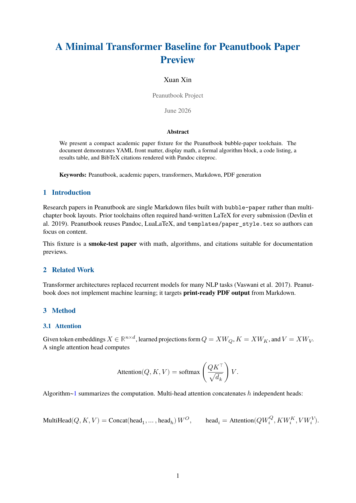
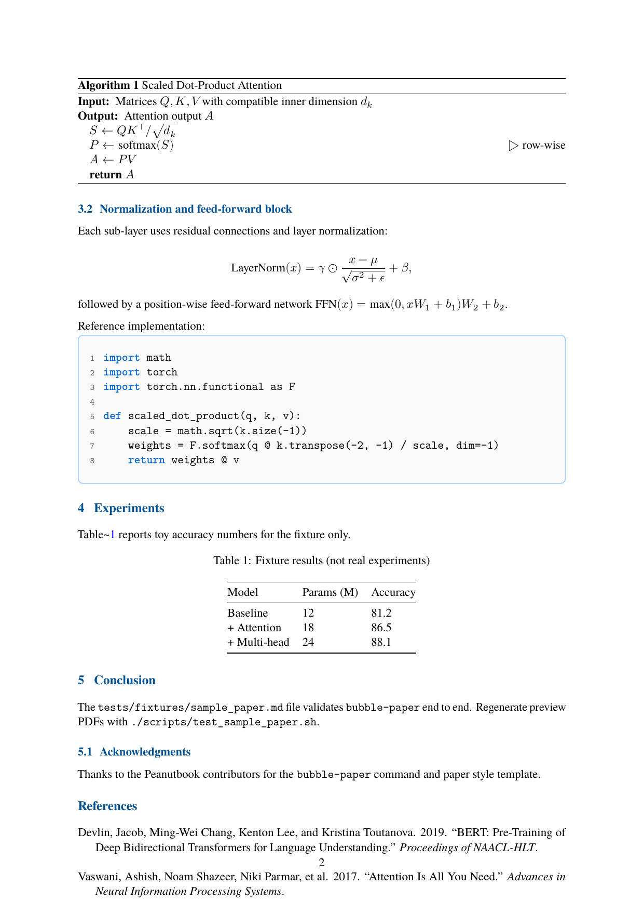
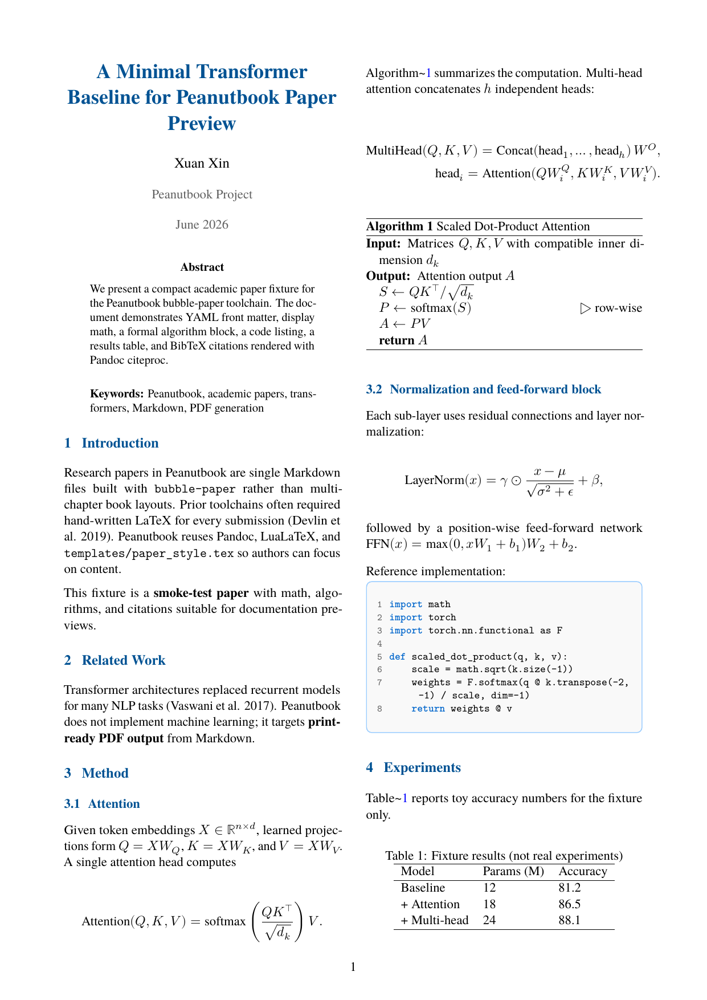
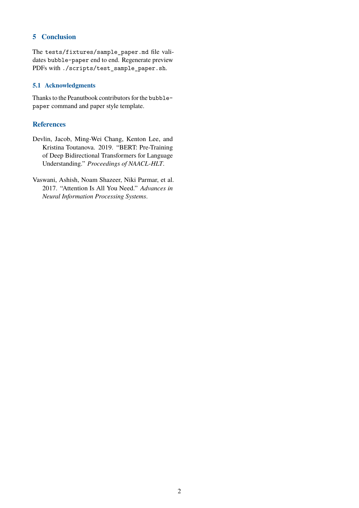

# Academic papers (`bubble-paper`)

Peanutbook includes a workflow for **research and academic papers**: one Markdown file → PDF with article layout, title block, abstract, keywords, and optional bibliography.

This path uses the **`bubble-paper`** command. It does not use chapter folders, `peanut.config`, or book print templates.

## PDF previews

The screenshots below come from the sample fixture `tests/fixtures/sample_paper.md` in the **peanutbook** source repository (author **Xuan Xin**). Regenerate them with `./scripts/test_sample_paper.sh`.

=== "Single column (default)"

    

    Page 1: centered title block, abstract with keywords, numbered sections.

    

    Page 2: display math, `algorithm` block, Python listing with line numbers, table, and references.

=== "Two column (`--two-column`)"

    

    Page 1: same metadata as single-column; introduction and related work in two columns.

    

    Page 2: equations scaled or split for column width, floating table, numbered code blocks.

## Quick start

```bash
bubble-paper --init              # scaffold paper.md in cwd
# edit paper.md (YAML front matter + sections)
bubble-paper paper.md              # build PDF next to the .md file
```

Alternative scaffold:

```bash
bubble-scaffold --paper
```

Two-column layout:

```bash
bubble-paper paper.md --two-column
```

## Command reference

| Flag | Effect |
|------|--------|
| `markdown` | Input `.md` path (required unless `--init`) |
| `-o`, `--output` | Output PDF path (default: same basename as input) |
| `--init` | Write bundled `paper.md` template to cwd |
| `--lang` | Document language (`en`, `cn`, `tc`, `jp`, `sp`) — CJK uses LuaLaTeX + `luatexja` |
| `--papersize` | `a4` (default) or `letter` |
| `--two-column` | Two-column article layout |
| `--template` | Optional custom Pandoc LaTeX template |
| `--optimize-pdf` | Shrink PDF with Ghostscript (or qpdf for CJK) when output is large enough |
| `--optimize-pdf-quality` | `screen`, `ebook`, `printer`, `prepress` (English Ghostscript only) |
| `--style` | Ignored (accepted for script compatibility with `bubble-build`) |

Examples:

```bash
bubble-paper paper.md --papersize a4
bubble-paper paper.md --two-column --optimize-pdf
bubble-paper paper.md --lang cn
```

## YAML front matter

Optional YAML at the top of the Markdown drives the title page and metadata:

```yaml
---
title: "Paper Title"
author: "Author Name"
affiliation: "Department, University"
date: "\\today"
abstract: |
  Summarize the problem, approach, and main results.
keywords: "machine learning, NLP, evaluation"
bibliography: references.bib
layout: two-column   # optional; same as --two-column
---
```

| Key | Purpose |
|-----|---------|
| `title` | Paper title (centered on title block) |
| `author` | Author name(s) |
| `affiliation` | Institution or department (shown under author) |
| `date` | Publication date (LaTeX `\\today` or a fixed string) |
| `abstract` | Abstract paragraph (use `\|` block scalar for multiple lines) |
| `keywords` | Keyword line printed after the abstract |
| `bibliography` | Path to a `.bib` file (enables Pandoc `--citeproc`) |
| `layout` | `two-column` / `twocolumn` instead of `--two-column` flag |

## Suggested structure

The bundled template includes typical sections:

1. **Introduction**
2. **Related Work**
3. **Method**
4. **Experiments**
5. **Conclusion**
6. **Acknowledgments** (optional subsection)
7. **References** (filled when `bibliography` is set)

Sections are numbered automatically (`--number-sections`). Use standard Peanutbook Markdown for figures, math, tables, and code blocks — see [Syntax reference](markdown-syntax-extensions.md).

## Bibliography

When `bibliography: references.bib` is set and the file exists next to the Markdown (or at the given path), `bubble-paper` runs Pandoc with `--citeproc`. Add citation keys in the body:

```markdown
Prior work [@smith2020] showed ...
```

## PDF styling

`bubble-paper` includes `templates/paper_style.tex` and `templates/paper_code_style.tex` via Pandoc `-H`:

| Feature | Single column | Two column |
|---------|---------------|------------|
| Body font | Serif (TeX Gyre Termes or Latin Modern Roman) | Same |
| Headings | Blue title and section headings | Same |
| Margins | 1 inch | 0.75 inch |
| Column gutter | — | 0.3 inch (`\columnsep`) |
| Code blocks | Listings + line numbers | Smaller type; math/tables auto-fit column width |
| Abstract | **Abstract** block + **Keywords** line | Title/abstract full width; body twocolumn |

For book proposals, use [`bubble-proposal`](commands/build-convert.md#bubble-proposal). For business plans, see **[Business plans](bizplan.md)**.

## Algorithms and math

Display equations, multi-line align, and formal algorithm blocks are supported:

````markdown
$$
\mathrm{Attention}(Q, K, V) = \mathrm{softmax}\left(\frac{QK^\top}{\sqrt{d_k}}\right)V .
$$

```{.algorithm caption="Scaled Dot-Product Attention" label="alg:attention"}
\Require Matrices $Q, K, V$ with compatible inner dimension $d_k$
\Ensure Attention output $A$
\State $S \gets Q K^\top / \sqrt{d_k}$
\State $P \gets \mathrm{softmax}(S)$ \Comment{row-wise}
\State $A \gets P V$
\State \Return $A$
```
````

- `scripts/algorithm_blocks.lua` converts `{.algorithm …}` fences to LaTeX `algorithm` environments.
- Cross-references: `Algorithm~\ref{alg:attention}` (raw LaTeX).
- Two-column builds use `scripts/paper_twocolumn_math.lua` to split wide equations and shrink overflow.
- Two-column tables use `scripts/paper_floating_tables.lua` (floating `table` instead of `longtable`).

## Code listings

Fenced code blocks render with syntax highlighting, a light border, and **left line numbers** by default:

```python
def scaled_dot_product(q, k, v):
    scale = math.sqrt(k.size(-1))
    weights = F.softmax(q @ k.transpose(-2, -1) / scale, dim=-1)
    return weights @ v
```

Per-block opt-out: put `#NOLINENUM` on the first line inside the fence (same as books).

## Python API

```python
from pathlib import Path
from bubble.paper import build_paper_pdf

build_paper_pdf(
    Path("paper.md"),
    Path("paper.pdf"),
    lang="en",
    papersize="a4",
    two_column=False,
    optimize_pdf=False,
)
```

`build_paper_pdf` returns `0` on success, non-zero on failure. CLI equivalent: `bubble-paper`.

## Sample fixture

| File | Purpose |
|------|---------|
| `tests/fixtures/sample_paper.md` | End-to-end sample (math, algorithm, code, table, citations) |
| `tests/fixtures/sample_paper.bib` | BibTeX for `--citeproc` |
| `scripts/test_sample_paper.sh` | Builds PDFs and documentation PNGs |

```bash
# In the peanutbook repo
./scripts/test_sample_paper.sh

# Also copy PNGs to peanutbook-docs (optional)
PEANUTBOOK_DOCS=/path/to/peanutbook-docs ./scripts/test_sample_paper.sh
```

| PNG (in `docs/img/`) | Contents |
|----------------------|----------|
| `paper-preview-single.png` | Single-column page 1 |
| `paper-preview-single-method.png` | Single-column page 2 (method) |
| `paper-preview-twocol.png` | Two-column page 1 |
| `paper-preview-twocol-method.png` | Two-column page 2 (method) |

## See also

- [Build & convert — `bubble-paper`](commands/build-convert.md#bubble-paper) — short CLI summary
- [Command reference overview](commands/overview.md)
- [System requirements](system-requirements.md) — Pandoc, LuaLaTeX
