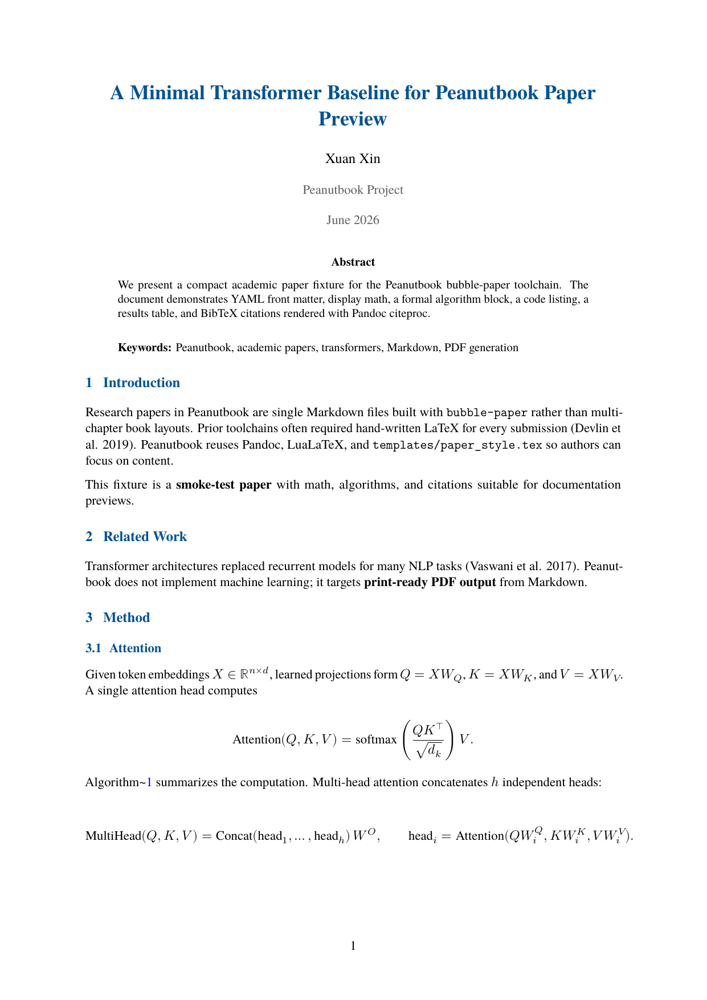
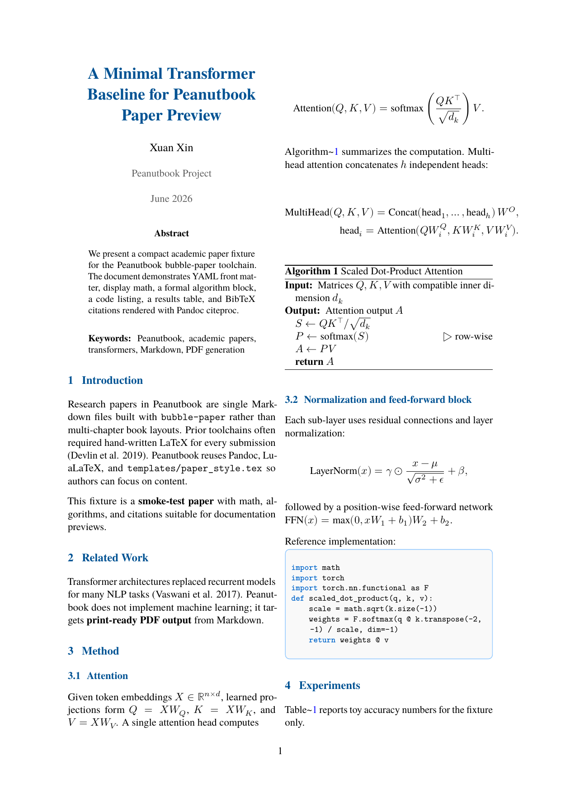
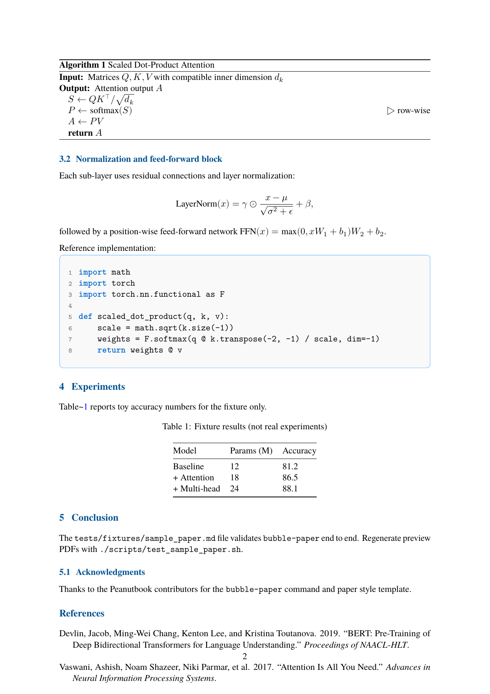
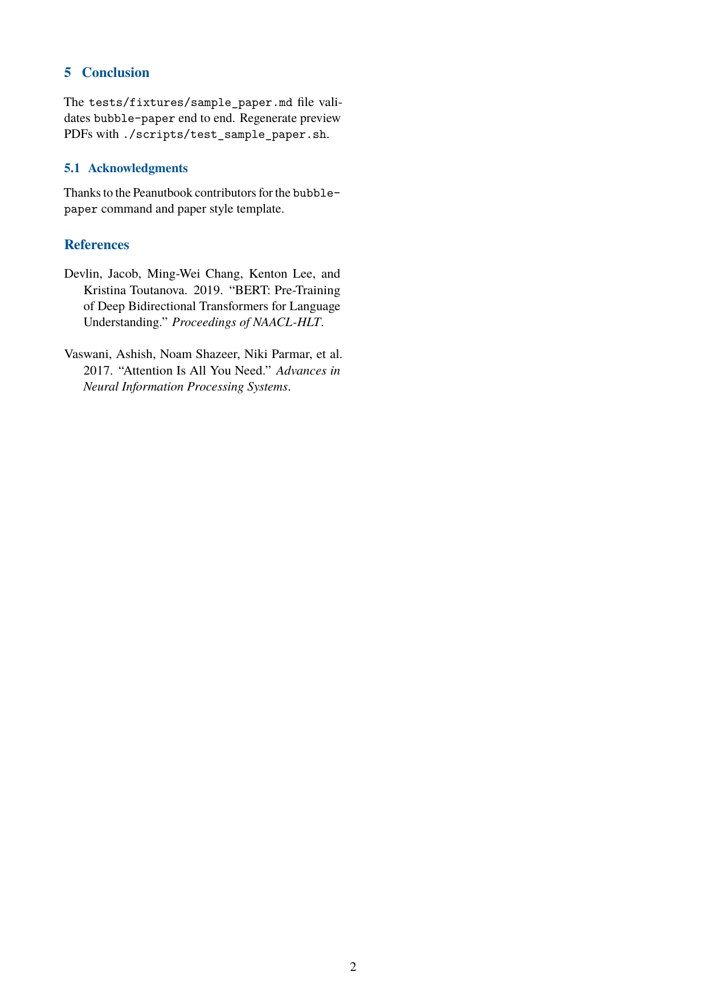

# Academic papers (bubble-paper)

`bubble-paper` compiles a single Markdown file into a PDF research paper — not a multi-chapter book — via Pandoc + LuaLaTeX, with optional two-column layout, BibTeX citations, and algorithm/code blocks.

```bash
bubble-paper --init
bubble-paper paper.md --papersize a4
bubble-paper paper.md --two-column
```

## CLI flags

| Flag | Default | Notes |
|------|---------|-------|
| `markdown` (positional) | required unless `--init` | |
| `-o, --output` | same basename, `.pdf` | |
| `--lang` | `en` | `en`, `cn`, `tc`, `jp` (CJK via LuaTeX-ja), `sp` |
| `--papersize` | **`a4`** | `letter` or `a4` — note the default differs from `bubble-bizplan`, which defaults to `letter` |
| `--two-column` | off | Two-column article layout |
| `--template` | none | Custom Pandoc LaTeX template |
| `--optimize-pdf` | off | Ghostscript, or `qpdf` for CJK |
| `--optimize-pdf-quality` | `printer` | `screen`, `ebook`, `printer`, `prepress` |
| `--init` | — | Scaffolds `./paper.md` in the current directory (always this path — no target argument) |
| `--style` | none | Accepted but ignored — papers always use article layout; kept for script compatibility |

There is no `peanut-paper.config` file — every setting comes from CLI flags or the markdown's own YAML front matter.

## YAML front matter

| Field | Used for |
|-------|----------|
| `title` | Title block |
| `author` | Author block |
| `affiliation` | Rendered under the author |
| `date` | Title block |
| `abstract` | Block scalar (`\|`); rendered as the abstract |
| `keywords` | Comma-separated string |
| `bibliography` | Filename of a `.bib` file, resolved relative to the markdown file |
| `layout` | `"two-column"` / `"twocolumn"` / `"2-column"` — enables two-column mode without needing `--two-column` |

## Bibliography

Format is **BibTeX**. Set `bibliography: refs.bib` in front matter, then cite with standard Pandoc citeproc syntax:

```markdown
Attention mechanisms scale well [@vaswani2017attention].
```

Add a `# References` heading where Pandoc should insert the generated bibliography. If the `.bib` file is set but not found, a warning is logged and the build proceeds without citations.

## Two-column layout

- `-V classoption=twocolumn`, margins tightened to `0.75in` (vs `1in` single-column), `11pt`, `documentclass=article`.
- Extra Lua filters activate only in two-column mode: one keeps tables as floating `\begin{table}` blocks rather than `\begin{longtable}`, another reflows display math for narrow columns (e.g. `\begin{align*}`, `\resizebox{\linewidth}`).
- Algorithm blocks (` ```{.algorithm caption="..." label="..."} `) and numbered code listings work in both single- and two-column modes.
- Papersize (`letter`/`a4`) and `--lang` work the same in both column modes.

## PDF previews

Rendered from `tests/fixtures/sample_paper.md`, built once plain and once with `--two-column`, page 1 and the "Method" page (page 2) of each:

| Single column | Two column |
|---------------|------------|
|  |  |
|  |  |
