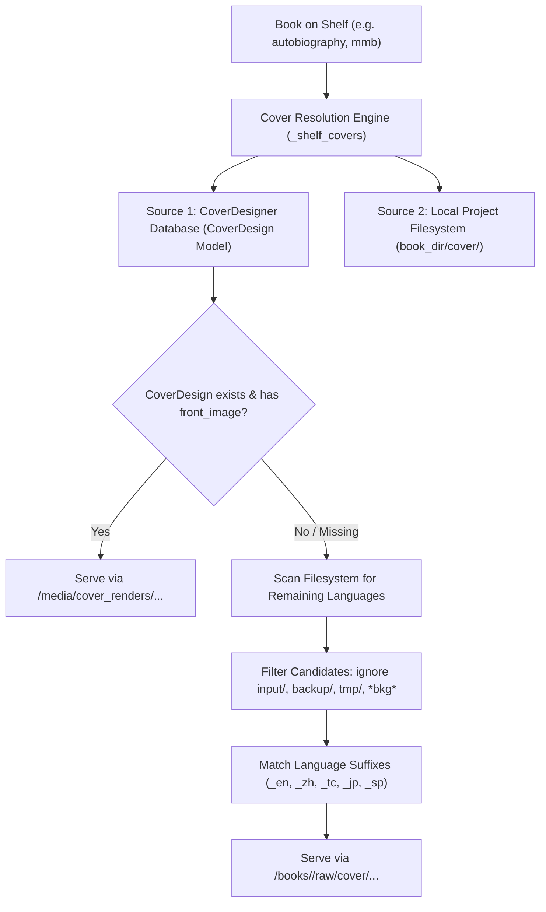

# Bookshelf Cover Resolution & Management

This document details how the Peanutbook web interface (`http://127.0.0.1:1979/`) discovers, resolves, and renders book cover images on the main Bookshelf view (`/`).

---

## 1. Dual-Source Cover Architecture

The bookshelf automatically resolves cover images using a **hybrid dual-source architecture**, prioritizing custom interactive designs from the database while seamlessly falling back to local filesystem print covers:

### Source 1: Web CoverDesigner (Database Model)
- **Model**: `coverdesigner.models.CoverDesign`
- **Physical storage path**:
  - In container: `/data/media/cover_renders/front_<hash>.(png|jpg)`
  - On host: `web/media/cover_renders/`
- **Web URL**: `/media/cover_renders/front_<hash>.png`
- **Use case**: Books whose covers are created or customized using the visual Cover Designer UI (`/11/<book_slug>/edit/`).

### Source 2: Local Project Filesystem (Pre-rendered Print Covers)
- **Root directory**: `projects.book_dir(book.slug)` (e.g., `/home/wukong/<book_slug>` or `/shelf/<book_slug>`)
- **Cover directory**: `<book_root>/cover/<trim_size>/out/`
- **Web URL**: `/books/<book_slug>/raw/<relative_path_to_cover>`
- **Use case**: Books with high-resolution export covers generated via Python print scripts or traditional publishing pipelines.

---

## 2. Filesystem Cover Discovery & Filtering Rules

When inspecting a book's `cover/` directory, the engine applies strict quality and priority heuristics:

### 1. Exclusion Rules (Ignore Non-Final Assets)
The engine strictly ignores intermediate design assets and raw background photos:
- Directories ignored: `input/`, `backup/`, `tmp/`, `cache/`, `.build/`
- File stems containing `bkg` (e.g., `cover_front_bkg.png` background photos without typography)

### 2. Output Priority
- Candidate files inside an `out/` directory (e.g., `cover/7x10/out/`) are prioritized over non-`out/` directories.
- Web-optimized `.jpg` files are prioritized over heavy print `.png` files for fast shelf loading.

### 3. Language Suffix Matching
Language suffixes are matched in filename stems:
| Filename Pattern | Recognized Language | Shelf Badge |
|---|---|---|
| `cover_front.jpg` / `cover_front.png` | `en` (or book default) | `EN` |
| `*cover_front_en.*` | `en` | `EN` |
| `*cover_front_zh.*` / `*cover_front_cn.*` | `zh` | `中文` |
| `*cover_front_tc.*` | `tc` | `繁體` |
| `*cover_front_jp.*` / `*cover_front_ja.*` | `jp` | `日本語` |
| `*cover_front_sp.*` / `*cover_front_es.*` | `sp` | `Español` |
| `*cover_front_fr.*` | `fr` | `Français` |
| `*cover_front_de.*` | `de` | `Deutsch` |

---

## 3. Real Book Cover Locations on Disk

Here is how each book's covers currently resolve on the shelf:

### 1. 《云层之上 / Above The Clouds》(`autobiography`)
- **Location on Host**: `/home/wukong/autobiography/cover/7x10/out/`
- **Languages supported**: 5 languages
  - **EN**: `cover/7x10/out/cover_front.jpg`
  - **中文**: `cover/7x10/out/cover_front_zh.jpg`
  - **繁體**: `cover/7x10/out/cover_front_tc.jpg`
  - **日本語**: `cover/7x10/out/cover_front_jp.jpg`
  - **Español**: `cover/7x10/out/cover_front_sp.jpg`

### 2. 《Mortgage Markets in the Age of AI》(`mmb`)
- **EN & 中文**: Rendered via CoverDesigner database (`/data/media/cover_renders/`)
- **繁體**: `cover/7x10/out/cover_front_tc.jpg`

### 3. 《Distributed AI Systems》(`distributed-ai-systems`)
- **EN**: `/home/wukong/distributed-ai-systems/cover/7.5x9.25v2/cover_front.jpg`

### 4. 《Coding Agents》(`coding-agent`)
- **EN**: Rendered via CoverDesigner database
- **中文**: `cover/7x10/out/cover_front_zh.jpg`

---

## 4. Multi-Language Shelf UI

When a book has multiple cover variants:
- A floating frosted-glass language switcher appears at the bottom of the card thumbnail: `[ EN | 中文 | 繁體 | 日本語 | Español ]`.
- Hovering or clicking any language pill instantly switches the card's cover thumbnail without reloading the page.
- The bookshelf grid automatically provides sufficient width (`minmax(270px, 1fr)`) with hidden scrollbars for clean multi-edition presentation.
